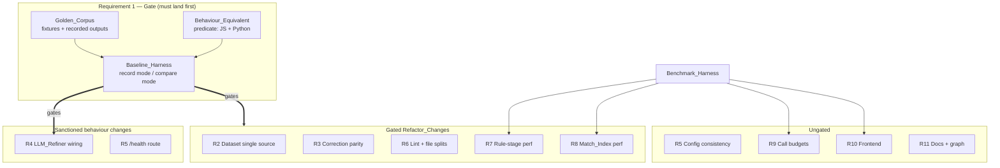
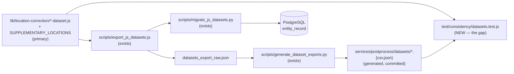
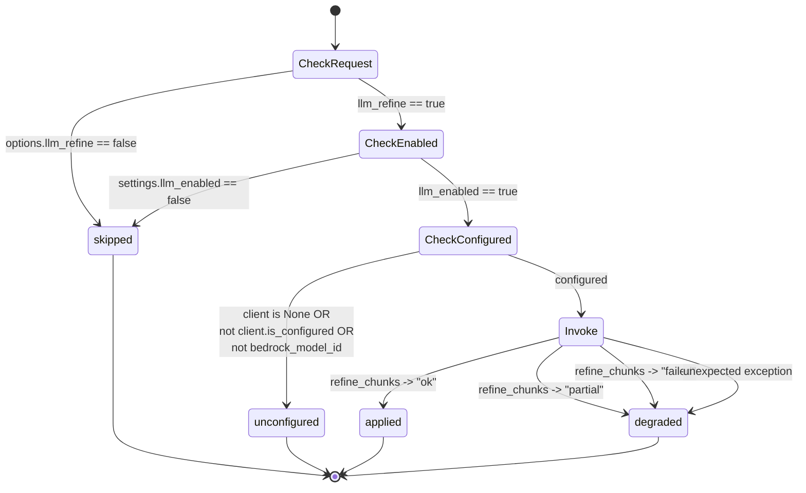
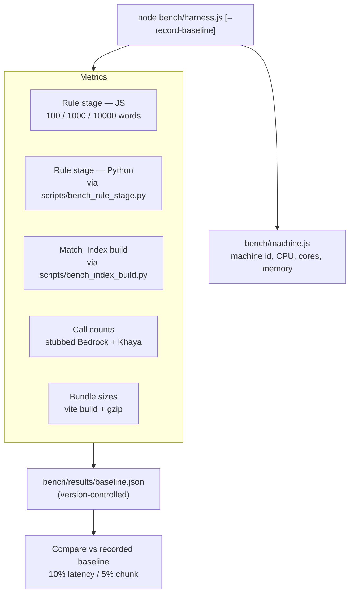

# Design Document

## Overview

This design covers a repository-wide cleanup and performance-optimization effort across four
surfaces: the Gateway plus `lib/`, the Postprocess_Service, the Frontend, and repository
configuration and documentation.

The organising constraint is that almost every change here is a Refactor_Change, so the design is
built around a single gate: the Baseline_Harness (Requirement 1). Nothing that touches correction
code lands until the Golden_Corpus and its recorded outputs exist and the Behaviour_Equivalent
predicate is executable in both languages. Only two behaviour changes are sanctioned — the
LLM_Refiner wiring (Requirement 4) and the Gateway `/health` route (Requirement 5) — and both are
specified precisely below so they cannot be mistaken for drift.

### Investigation summary

The design is grounded in the current code, not the requirements summary. Findings that changed the
shape of the design:

1. **A Golden_Corpus precursor already exists.** `services/postprocess/tests/fixtures/regression_corpus.json`
   holds 19 cases with `id`, `description`, `category`, `input_transcript`, `expected_transcript`,
   `should_correct`, `expected_entities`. It is consumed only by the Python side
   (`tests/integration/test_regression_corpus.py`) and records *expected* values, not *recorded
   baseline* values. The design extends this file rather than starting fresh, and adds a separate
   recorded-output store alongside it.

2. **A dataset export chain already exists and runs in the right direction.**
   `services/postprocess/scripts/export_js_datasets.js` `require`s the JS dataset modules and prints
   one JSON document on stdout; `scripts/migrate_js_datasets.py` shells out to it via `subprocess`;
   `scripts/generate_dataset_exports.py` turns a raw export into the CSV/JSON files under
   `services/postprocess/datasets/`. So JS is already the de facto primary Dataset_Source. The
   design keeps that direction and adds the missing consistency check, rather than designing a
   parallel mechanism.

3. **The JS word-level walk lives in `server.js`, not in `lib/`.** `legacyPostprocess` in `server.js`
   contains the title-aware and 3→2→1 n-gram walk plus a function-local `wordStopwords` Set. The
   Python equivalent lives inside `correct_words` in `app/correction/engine.py`. This asymmetry is
   the single biggest obstacle to both the Baseline_Harness and the parity test, because `server.js`
   exports nothing and calls `app.listen()` at import time. Extracting that walk is therefore a
   prerequisite task, not an optional tidy-up.

4. **The LLM_Refiner is complete and unit-tested; only the wiring is missing.**
   `app/llm/refiner.py` exposes `refine_chunks(words, snapshot, bedrock_client, session, settings)`
   returning `(words, llm_status, count)` with statuses `ok`/`partial`/`failed`, and
   `tests/unit/test_refiner.py` covers timeouts, guards, and chunking. `app/pipeline.py` stage 3
   never calls it. `BedrockClient` is never constructed anywhere in `app/`. This is wiring work.

5. **The `/health` proxy/route mismatch is confirmed.** `deploy/Caddyfile` has
   `handle /health { reverse_proxy localhost:{$BACKEND_PORT:8081} }`; `server.js` implements no
   `/health` route; `fly.toml` has no `[[http_service.checks]]` block.

6. **The frontend already lazy-loads every page route.** `frontend/src/router.tsx` wraps all six
   pages in `React.lazy`, so Requirement 10.3 is likely already satisfied and needs measurement
   rather than implementation. `TranscriptViewer` already delegates to `VirtualList` above 500
   segments, but its `raw` and `prose` view modes render unwindowed, which is where the
   Requirement 10.5 budget will bite.

### Performance budget validation — read this before treating any number as a target

The figures in Requirements 7 through 10 — **500ms** for the rule stage at 10000 words, **3s** for
the Match_Index build, **250KB** gzipped for the entry chunk, **200** mounted word elements — are
**proposals, not measurements**. No baseline for them exists in this repository today. The evidence
that they need validating:

- `services/postprocess/tests/load/test_performance.py` sets
  `_SINGLE_REQUEST_BUDGET_MS = 30000.0` for a **1000**-word transcript, with the comment
  "Relaxed for dev/CI (prod target: 300ms)". A dev machine needing a 30s guard for 1000 words is
  not obviously going to hit 500ms for 10000 words.
- The same file budgets the Match_Index build at **10 seconds** for 5000 records, against
  Requirement 8.2's proposed **3 seconds**.
- No gzipped chunk size has ever been recorded for the Frontend build.

Therefore the sequencing is: the Benchmark_Harness records the **real** pre-refactor baseline on the
Reference_Machine **first**; the recorded values become the regression floor under Requirements 7.4,
7.6, and 10.4; and the absolute budgets in 7.2, 8.2, 10.2, and 10.5 are then either confirmed or
revised by a requirements amendment that cites the measurement. Absolute-budget assertions are
written as **reporting** checks, not failing assertions, until a measured baseline exists. Do not
present these four numbers as validated targets in tasks or commit messages.

### Authoritative engine decision

**The PY_Correction_Engine is authoritative for correction-algorithm changes.** Confirmed with the
user during this design phase. Rationale: `POSTPROCESS_MODE=python` is the long-term destination, so
fixes land in the destination implementation first and are ported to JS only for as long as `js`
remains the default production mode, rather than being ported backward indefinitely. The Python
implementation is also the better-structured one — split across `strategies.py`, `scoring.py`,
`blocklist.py`, `phonetics.py` with a PostgreSQL-backed Dataset_Store — and carries the richer test
suite.

This decision is recorded in `.kiro/steering/backend-guide.md` under Requirement 3.3, and encoded in
the parity harness as a single named constant so the direction of any required port is unambiguous.

Note that `POSTPROCESS_MODE` keeps its `js` default. Flipping it is a behaviour change beyond the two
sanctioned ones and is explicitly out of scope.

## Architecture

### Surfaces and the harnesses that gate them



### Sequencing and gating (Requirement 1 ordering)

Strictly ordered chains. Nothing in a later phase may land before its predecessor.

| Phase | Work | Gated by | Why |
| ----- | ---- | -------- | --- |
| 0 | Extract the word-level n-gram walk out of `server.js` into `lib/location-correction/word-walk.js`; extract `wordStopwords` to module scope | — | `server.js` calls `app.listen()` at import and exports nothing, so no harness can reach `legacyPostprocess`. Without this the Baseline_Harness cannot record the JS baseline at all. This extraction is itself behaviour-preserving and is covered by the pre-existing `test/location-correction/` and `test/routes/` suites. |
| 1 | Golden_Corpus fixtures (30+), `Behaviour_Equivalent` in JS and Python, Baseline_Harness record + compare modes, wire into `pnpm test` and `pytest` | Phase 0 | Requirement 1. The gate. |
| 1b | Benchmark_Harness skeleton + **record the real pre-refactor baseline** on the Reference_Machine | Phase 0 | Requirements 7.5, 8.1, 9.7, 10.1. Must precede any perf work, and validates or invalidates the four proposed budgets. |
| 2 | Dataset consistency check (R2); config consistency check + `deepgram.toml` `[test]` fix (R5.1, 5.2, 5.7, 5.8) | Phase 1 | R2 touches generated artefacts that the corpus depends on. The config work is read-only against source and could run in parallel, but the `pnpm test` wiring is shared, so it is cheaper to land together. |
| 3 | Parity test + divergence inventory (R3) | Phases 1, 2 | Needs both engines reachable from one harness and the datasets aligned, or every parity failure is ambiguous between "algorithm differs" and "dataset differs". |
| 4 | LLM_Refiner wiring (R4.1–4.4); dead-code removals (R4.5, 4.6) | Phase 1 | Sanctioned behaviour change, so the baseline must exist to prove the *rule* stages did not move. |
| 5 | Lint tooling + the three file splits (R6) | Phases 1, 4 | Splitting after the dead code is gone avoids carrying doomed symbols into new modules. |
| 6 | Perf work against measured baselines (R7, R8, R9, R10) | Phase 1b | Meaningless without a recorded baseline. |
| 7 | `/health` route + deploy config (R5.5, 5.6) | — | Independent; sanctioned behaviour change. |
| 8 | Docs + graph rebuild (R11) | All | Must reflect the final state. R11.1 also applies continuously to every commit. |

**Parallelisable:** Phase 7 (`/health` + deploy) is independent of everything and can proceed at any
time. Within Phase 2, the dataset check and the config check are independent of each other. Within
Phase 6, R7/R8 (backend), R9 (call budgets), and R10 (frontend) are mutually independent. R11.1
(keeping listings current) is a per-commit obligation throughout, not a phase.

**Strictly ordered:** Phase 0 → 1 → {2 → 3}, and 1 → 4 → 5, and 1b → 6.

### Repository layout additions

```text
test/
  baseline/
    behaviour-equivalent.js       # Behaviour_Equivalent predicate (JS)
    record.js                     # record mode — writes recorded outputs
    baseline.test.js              # compare mode — runs under `pnpm test`
    behaviour-preservation.pbt.test.js
    idempotence.pbt.test.js
    noop.pbt.test.js
  parity/
    parity.test.js                # R3.2 model-based JS vs Python
    accepted-divergences.json     # declared divergences the test consults
  consistency/
    datasets.test.js              # R2.3, R2.4
    config.test.js                # R5.7
    dataset-roundtrip.pbt.test.js # R2.5
bench/
  harness.js                      # Benchmark_Harness driver (JS + orchestration)
  machine.js                      # Reference_Machine identity capture
  results/
    baseline.json                 # version-controlled measurements
fixtures/golden-corpus/
  corpus.json                     # shared fixtures — single copy
  recorded/
    js/<fixture-id>.json          # recorded JS_Correction_Engine outputs
    py/<fixture-id>.json          # recorded PY_Correction_Engine outputs
lib/location-correction/
  word-walk.js                    # extracted from server.js legacyPostprocess
services/postprocess/
  tests/baseline/
    conftest.py
    test_baseline.py              # compare mode under pytest
    test_behaviour_preservation.py
  scripts/
    record_baseline.py            # record mode (Python side)
    bench_rule_stage.py           # R7.1 Python-side timings
    bench_index_build.py          # R8.1
```

`fixtures/golden-corpus/` sits at the repository root, not under `test/` or
`services/postprocess/tests/`, precisely so that neither language owns it and neither copy can drift.

## Components and Interfaces

### 1. Baseline_Harness (Requirement 1)

#### Storage and versioning of the Golden_Corpus

`fixtures/golden-corpus/corpus.json` holds the fixtures. It is a superset of today's
`regression_corpus.json` schema so the existing 19 cases migrate without edits, plus the fields the
Baseline_Harness needs:

```json
{
  "version": "2.0.0",
  "cases": [
    {
      "id": "fused-ningo",
      "description": "Fused spelling corrects to hyphenated canonical",
      "category": "fused",
      "input_transcript": "ningoprampram",
      "input_words": [
        { "word": "ningoprampram", "start": 0.0, "end": 0.4, "confidence": 0.91 }
      ],
      "expected_transcript": "Ningo-Prampram",
      "should_correct": true,
      "expected_entities": ["Ningo-Prampram"]
    }
  ]
}
```

`input_words` is new and required: Behaviour_Equivalent compares word arrays, so the corpus must
carry word-level input with `start`, `end`, and `confidence`. Where a migrated case has no
`input_words`, the loader synthesises one from `input_transcript` using fixed 0.3s spacing and
confidence 0.95, matching what `test_regression_corpus.py` does today, so migration is mechanical.

Recorded outputs live in `fixtures/golden-corpus/recorded/{js,py}/<fixture-id>.json`, one file per
fixture per engine:

```json
{
  "fixture_id": "fused-ningo",
  "engine": "js",
  "corpus_version": "2.0.0",
  "recorded_at": "2026-02-20T00:00:00Z",
  "transcript": "Ningo-Prampram",
  "words": [
    {
      "word": "Ningo-Prampram", "start": 0.0, "end": 0.4, "confidence": 0.91,
      "locationCorrected": true, "entityKind": "location", "entityType": "constituency"
    }
  ],
  "entities": [{ "name": "Ningo-Prampram", "kind": "location", "type": "constituency", "mentions": 1 }],
  "corrections": [
    { "original": "ningoprampram", "corrected": "Ningo-Prampram", "strategy": "fused", "confidence": 0.95 }
  ]
}
```

One file per fixture rather than one big file, for three reasons: a diff on a single fixture is
readable in review; a re-record touching one fixture cannot accidentally rewrite the others; and
Requirement 1.10's rule — recorded outputs change only in a commit that states the intended
behaviour change — becomes visually enforceable at review time.

Versioning: `corpus_version` in each recorded file must equal `version` in `corpus.json`. The compare
step fails loudly on mismatch, which catches the case where fixtures were edited but outputs were
not re-recorded.

#### Separating record mode from compare mode

This is the part Requirement 1.10 turns on, so the separation is structural rather than a flag:

- **Record mode** lives in `test/baseline/record.js` and `services/postprocess/scripts/record_baseline.py`.
  Neither file matches the test glob (`test/**/*.test.js`, `testpaths = ["tests"]`), so neither can be
  executed by `pnpm test` or `pytest`. They are invoked deliberately:
  `node test/baseline/record.js` and `python scripts/record_baseline.py`.
- **Compare mode** lives in `test/baseline/baseline.test.js` and
  `services/postprocess/tests/baseline/test_baseline.py`. These **only read** the recorded files.
  They import nothing from the record-mode modules and contain no filesystem write path.

Belt and braces on top of the structural split:

1. Record mode refuses to run when `recorded/` already contains files for the current
   `corpus_version` unless `--force` is passed, and prints the fixture ids it would overwrite.
2. Record mode writes a `recorded/MANIFEST.json` of `fixture-id → sha256` of each recorded file.
   Compare mode verifies each file against the manifest hash, so a hand-edited recorded file fails
   the same way a stale one does.
3. A guard test (`test/consistency/baseline-integrity.test.js`) asserts that no file under
   `test/**/*.test.js` or `services/postprocess/tests/**` imports the record-mode modules or writes
   under `fixtures/golden-corpus/recorded/`. This is the mechanical form of "a refactor cannot
   silently re-record the baseline it is being checked against."

#### The Behaviour_Equivalent predicate

One definition, two implementations, both derived from the same glossary clause: transcripts
byte-identical; word arrays equal element-wise on `word`, `start`, `end`, `confidence`,
`locationCorrected`, `entityKind`, `entityType`; entity summaries equal as multisets of
`(name, kind, type, mentions)`.

JS — `test/baseline/behaviour-equivalent.js`:

```javascript
/**
 * Compares two pipeline outputs for Behaviour_Equivalence.
 * @param {{transcript: string, words: Array, entities: Array}} actual
 * @param {{transcript: string, words: Array, entities: Array}} expected
 * @returns {{ equivalent: boolean, differences: Array<{field: string, baseline: *, actual: *}> }}
 */
function behaviourEquivalent(actual, expected) { /* ... */ }

const COMPARED_WORD_FIELDS = [
  'word', 'start', 'end', 'confidence',
  'locationCorrected', 'entityKind', 'entityType',
];
```

Python — `services/postprocess/tests/baseline/conftest.py` exposes
`behaviour_equivalent(actual, expected) -> tuple[bool, list[Difference]]` with the identical field
list and identical multiset semantics.

Three normalisation rules, needed because the two runtimes serialise differently. Each is a
deliberate decision, not an accident:

1. **Absent vs false flags.** `server.js` only sets `locationCorrected` when truthy;
   `CorrectedWord` omits `None` under `exclude_none=True`. So absent and `false` are treated as
   equal for the three boolean flags. Any other divergence in a flag is a real difference.
2. **Float comparison.** `start`, `end`, and `confidence` compare exactly by default, because both
   engines pass provider values through untouched. Where a corrected word inherits `end` from a
   later word (the merge path in both walks), the value is still copied verbatim, so exact
   comparison holds. If a real float tolerance turns out to be needed, it is added as an explicit
   `1e-9` epsilon with a comment naming the case, never widened silently.
3. **Entity summary ordering.** Compared as a multiset, per the glossary. Order differs legitimately
   between the two engines because the JS path builds it from `entitiesFound` on the text result
   while the Python path merges text and word entities in `_build_entity_summary`.

#### Sharing 30+ fixtures across both suites without duplication

Both suites read the same `fixtures/golden-corpus/corpus.json`. Neither copies it.

- JS: `require('../../fixtures/golden-corpus/corpus.json')` — resolves from the repo root, which is
  already how `test/` reaches `lib/` and `test_audio/`.
- Python: `Path(__file__).parents[3] / "fixtures" / "golden-corpus" / "corpus.json"`. The existing
  `test_regression_corpus.py` already walks up with `Path(__file__).parent.parent`, so this is the
  same pattern with one more level.

A guard test asserts that `services/postprocess/tests/fixtures/regression_corpus.json` no longer
exists as an independent corpus once migration is done — either deleted, or reduced to a loader that
re-exports the shared file. Otherwise the duplication this design is removing quietly returns.

The Python side needs a `DatasetSnapshot` covering every entity the corpus references. Today
`test_regression_corpus.py` hand-builds nine `EntityRecord`s inline. At 30+ fixtures that hand-built
fixture becomes both a maintenance burden and a source of false parity failures. So the Python
baseline fixture builds its snapshot from the **generated** `services/postprocess/datasets/*.json`
files, which by Requirement 2 are generated from the primary Dataset_Source. Both engines then
resolve the same entities from the same origin, and a parity failure means the algorithms differ
rather than the fixtures differing.

#### Corpus coverage (Requirement 1.3)

Minimum 30 fixtures. The 19 existing cases carry over, so ≥11 are new. Coverage per category:

| Category | Existing | To add | Covers |
| -------- | -------- | ------ | ------ |
| `location` | via fuzzy-kumasi, tie-break | +3 | region, city, supplementary |
| `person` | initials-ofori-atta, title-person-carboo | +2 | president, speaker |
| `minister` | — | +2 | minister canonical + alias |
| `mp` | title-person-carboo | +1 | MP by constituency alias |
| `party` | party-ndc-abbr | +2 | abbreviation → canonical, canonical → abbreviation |
| `year` | 6 cases | — | years, guards |
| `decade` | year-decade | +1 | second decade form |
| `fused` | fused-ningo | — | fused tokens |
| `split` | fused-prampram | — | split tokens |
| `hyphenated` | — | +2 | hyphenated canonical, hyphen dropped in input |
| `no-entity` | 6 block_list cases | +1 | prose with nothing correctable |

### 2. Dataset single source of truth (Requirement 2)

#### Primary representation and generation direction

**Primary Dataset_Source: the `lib/location-correction/*-dataset.js` modules plus the
`SUPPLEMENTARY_LOCATIONS` array exported from `lib/location-correction/index.js`.** Generation runs
JS → CSV/JSON → PostgreSQL. This is not a new choice; it is the direction already implemented, and
`export_js_datasets.js` says so in its header: "stay the single source of truth for Ghana entities".

Keeping this direction rather than inverting it:

- The exporter already reproduces `buildDataset()` insertion order exactly via `source_rank`, and
  already documents why the minister rank sits between SPEAKERS and OTHER_NOTABLES (person aliases
  are last-wins, so loading out of order silently reassigns aliases). That ordering knowledge is
  hard-won and would have to be re-derived in the other direction.
- The `ghana-locations` npm package supplies regions and cities and is only reachable from Node.
  Inverting the direction would mean vendoring or re-exporting it.
- `SUPPLEMENTARY_LOCATIONS` is a JS literal inside `index.js`.

So the authoritative-engine decision (Python) and the primary-dataset decision (JS) point in
opposite directions. That is deliberate and worth stating plainly: **algorithms** are authoritative in
Python, **entity data** is authoritative in JS. They are independent axes — an algorithm fix does not
touch dataset files, and adding an entity does not touch algorithm code.

#### Existing chain and the one gap



The gap is only the consistency check. Nothing about the generation chain needs redesigning.

One fix to the chain is needed: `generate_dataset_exports.py` reads
`services/postprocess/datasets_export_raw.json`, a file that is neither committed nor produced by any
committed command. The design makes the raw export an explicit intermediate — either the script gains
`--from-node` to invoke the exporter itself (matching how `migrate_js_datasets.py` already shells out
via `subprocess`), or the documented invocation becomes
`node scripts/export_js_datasets.js > datasets_export_raw.json && python scripts/generate_dataset_exports.py`.
Preferred: `--from-node`, so there is one command and no chance of a stale intermediate.

#### Consistency check design (Requirements 2.3, 2.4)

`test/consistency/datasets.test.js`, running under `pnpm test`:

1. Invoke the exporter in-process (`require` its `build()` function — refactored to export `build`
   alongside its current `process.stdout.write`, so the check does not pay a subprocess).
2. Read the committed `services/postprocess/datasets/{persons,locations,parties,mps}.json`.
3. Project both sides to comparable tuples: `(canonical, entity_kind, entity_type)` for the
   round-trip requirement in 2.5, plus alias sets and the `region`/`constituency`/`party`/`role`
   attributes.
4. Compute three sets and fail if any is non-empty, **listing the differing entity names** as
   Requirement 2.3 demands: present in primary but missing from generated; present in generated but
   absent from primary; present in both but attributes differ.

The failure message names the regeneration command so the fix is obvious:

```text
Dataset drift detected — 2 entity(ies) differ.

Missing from generated representation (present in lib/location-correction):
  - Adenta East (location/constituency)
Attribute mismatch:
  - Kumasi: region "Ashanti" (primary) vs "" (generated)

Regenerate with:
  node services/postprocess/scripts/export_js_datasets.js --write-datasets
```

Because `generate_dataset_exports.py` writes the CSV with `alias_count` rather than the aliases
themselves, the JSON files are authoritative for alias comparison and the CSV is checked only for row
count and canonical set. Widening the CSV to carry full aliases is not needed and would bloat a file
whose purpose is human inspection.

### 3. Correction parity (Requirement 3)

#### Behavioural differences found between the two engines

Requirement 3.1 and 3.4 require this inventory to live in the design document. This is what the code
actually shows, not a projection.

**Stage-level differences (Requirement 3.4):**

| Stage | JS | Python | Resolution |
| ----- | -- | ------ | ---------- |
| Text-level entity correction | `correctLocations()` in `lib/location-correction/index.js` | `correct_text()` in `app/correction/engine.py` | Both present. Parity-tested. |
| Word-level n-gram walk | `correctWordsWalk()` in `lib/location-correction/word-walk.js` (extracted in Phase 0) | `correct_words()` in the engine module | Both present. Parity-tested. Extracted in Task 1.1. |
| Year/date correction | `year-correction.js`, 20 functions, single 744-line module | `app/years/` split into `corrector.py`, `patterns.py`, `numbers.py` | Both present. Parity-tested. Structural difference only. |
| LLM refinement | `bedrock-postprocess.js`, wired and running | `app/llm/refiner.py`, **implemented but not wired** | Requirement 4. Wire it. |
| Correction history persistence | **Absent** | `app/history/writer.py` — `CorrectionHistoryWriter`, `HISTORY_ENABLED` | Python-only. Accepted divergence: history is a service-side concern with a PostgreSQL dependency the Gateway does not have. Also currently unwired — see the dead-code inventory. |
| Structured logging / metrics | `console.log`/`console.error` | `app/obs/logging.py` (structlog), `app/obs/metrics.py` (EMF) | Accepted divergence — language-idiomatic observability, no bearing on correction output. |
| Block_List source | Four **function-local or unexported** literals: `COMMON_BLOCK` inside `matchFuzzy()`, `STOPWORDS` and `TITLE_PREFIXES` at module scope but unexported, `wordStopwords` inside `legacyPostprocess()` in `server.js` | Loaded from the `block_list` table into `DatasetSnapshot` as four frozensets | **Real risk.** The exporter transcribes all four verbatim with a "keep in sync" comment. Requirement 2's consistency check is extended to diff those literals against the seeded `block_list`, which is the only mechanical protection available. |

**Algorithm-level differences:**

| Aspect | JS | Python | Assessment |
| ------ | -- | ------ | ---------- |
| Strategy chain | `matchExact` → `matchFused` → `matchInitials` → `matchPhonetic` → `matchFuzzy` → `matchSubstring` | `match_exact` → `match_fused` → `match_initials` → `match_phonetic` → `match_fuzzy` → `match_substring` | Same order. Likely parity. |
| Short-input handling | `correctSingle` has no explicit length gate before the chain | `correct_single` gates on `MIN_CANDIDATE_LENGTH = 4`, trying only exact+fused below it | **Candidate real divergence.** Parity test will expose it. Resolution direction: JS adopts the Python gate, since Python is authoritative. |
| Word-level min token length | `w.word.length >= 3` inline in `server.js` | `_WORD_MIN_TOKEN_LENGTH = 3` | Same value, different location. Aligns once the walk is extracted. |
| Single-token expansion guard | `wordCount <= 2 \|\| isParty` | `canonical_token_count > 2 and not is_party` → reject | Equivalent. |
| Identity-match handling at n=1 | Case normalisation (`"ndc"` → `"NDC"`) counts as a correction | Explicitly mirrors this: "For n=1, skip identity check (JS behaviour)" | Deliberately aligned already. |
| Party display heuristic | `getPartyAbbr` + `w.word.length <= abbr.length + 1` in `server.js` | `apply_party_display` → `get_party_display` in `strategies.py` | Same heuristic, different placement. Verify threshold arithmetic matches exactly. |
| Fuzzy backend | Hand-written `levenshtein()` in `index.js` | `rapidfuzz` `Levenshtein.distance` + `pybktree` BK-tree | Same metric, different implementation. Distances should agree; tie-breaking among equidistant candidates may not. **Candidate divergence** in the ordering of equal-distance matches. |
| Double-title guard | Not present in the `server.js` walk | Present in `correct_words`: strips the leading token when the title equals the canonical's first word | **Candidate real divergence.** |
| Tie-break ordering | `correctSingle` returns first strategy hit | `correction_sort_key` = `(-confidence, -span_len, STRATEGY_RANK, canonical)` | Python has an explicit total order; JS relies on chain order. Equivalent for single hits, potentially divergent when multiple spans compete. **Candidate divergence.** |

Four **candidate** divergences (short-input gate, equidistant fuzzy tie-break, double-title guard,
multi-span tie-break) were marked candidate rather than confirmed because confirming them required
running the parity harness. The parity test has now been run (Task 9.3) and the findings are:

**Parity run confirmed verdicts (Task 9.3):**

| Candidate Divergence | Confirmed? | Verdict | Details |
| -------------------- | ---------- | ------- | ------- |
| Short-input length gate (MIN_CANDIDATE_LENGTH=4) | **Yes** | `port-to-js` | Observed in `party-ndc-abbr` and `party-cpp-abbr`: JS expands 3-letter party abbreviations in the transcript via `correctLocations()`; Python gates on MIN_CANDIDATE_LENGTH=4 and skips them. JS must adopt the same gate. |
| Equidistant fuzzy tie-break | **Yes** | `port-to-py` | Observed in `no-entity-prose`: Python's rapidfuzz matches "today" to "Akim Oda" above the threshold, which is overly aggressive. JS correctly rejects it. The Python fuzzy score cutoff needs tightening. |
| Double-title guard | **Not observed** | Aligned | No corpus fixture triggered this divergence. The existing recordings show equivalent behaviour for `title-person-carboo`. The guard may only diverge on inputs where the title word equals the canonical's first word — not exercised in the current corpus. |
| Multi-span tie-break | **Not observed directly** | `port-to-js` (via entity reporting) | Observed indirectly in `tie-break-exact-over-fused`: Python reports a "Kumasi" entity for an identity match (input already equals canonical); JS does not. This is tie-break adjacent — Python's `correction_sort_key` treats identity matches as valid results that produce entities, while JS only reports entities for actual corrections. |

**Additional divergences discovered by the parity run:**

| Divergence | Fixtures Affected | Verdict | Resolution |
| ---------- | ----------------- | ------- | ---------- |
| entityType granularity — JS uses generic "person" for all person kinds; Python preserves the dataset entity_type (minister, president, mp) | `minister-botchway`, `minister-osafo-maafo`, `mp-sam-nartey-george`, `person-president-nkrumah`, `person-speaker-adjetey`, `title-person-carboo`, `hyphenated-kyei-mensah-bonsu` (7 fixtures, 14 field-level diffs) | `port-to-js` | JS must preserve the granular entity type from the dataset instead of flattening to "person". |
| Block-list coverage — Python does not block "general", "nation", "national" from fuzzy correction | `block-general`, `block-nation`, `block-national` | `port-to-py` | Python's block list must be extended to match JS's COMMON_BLOCK entries. |
| Word-array structure — JS merges multi-word text corrections into a single word; Python preserves original word boundaries | `initials-ofori-atta` (8 field-level diffs) | `accepted` | Structural difference in how text-level corrections interact with the word array. Neither approach is wrong; they reflect different design decisions about word segmentation. |
| Identity-match entity reporting — Python reports entities for identity matches; JS does not | `tie-break-exact-over-fused` (2 field-level diffs) | `port-to-js` | JS should report entities when the input already matches a canonical name, to enable downstream entity analytics. |

All 30 divergence entries are recorded in `test/parity/accepted-divergences.json` with full fixture IDs, field paths, both engine values, reasons, and resolution directions.

#### Parity test structure (Requirements 3.2, 3.5, 3.6)

Cross-language comparison inside `pnpm test` cannot import Python. Two candidate mechanisms:

- **Rejected:** run the live Postprocess_Service and call it over HTTP. Needs PostgreSQL and a
  running service in the default test path, which would make `pnpm test` environment-dependent.
- **Chosen:** a committed **parity snapshot**. The Python side writes its Golden_Corpus outputs to
  `fixtures/golden-corpus/recorded/py/`, which the Baseline_Harness already produces. `parity.test.js`
  then compares `recorded/js/<id>.json` against `recorded/py/<id>.json` using the same
  `behaviourEquivalent` predicate. No subprocess, no database, no network.

This makes the parity test a **model-based** test in the property sense: the Python engine is the
model (authoritative), the JS engine is the implementation under test, and the recorded Python output
is the model's committed answer.

The staleness risk — snapshots drift from live Python behaviour — is handled by
`services/postprocess/tests/baseline/test_baseline.py` running under `pytest` and failing if live
Python output diverges from `recorded/py/`. So `pytest` guards snapshot freshness and `pnpm test`
guards parity, and neither needs the other's runtime.

#### Declaring accepted divergences

`test/parity/accepted-divergences.json`:

```json
{
  "version": "1.0.0",
  "divergences": [
    {
      "fixture_id": "initials-ofori-atta",
      "field": "words[0].word",
      "js_value": "K.",
      "py_value": "Ken Ofori-Atta",
      "reason": "Text path expands initials; the word path's min-token-length guard blocks it. Mirrors the _TEXT_ONLY_CATEGORIES allow-list already present in test_regression_corpus.py.",
      "authoritative": "py",
      "resolution": "accepted",
      "recorded_at": "2026-02-20"
    }
  ]
}
```

`resolution` is one of `accepted` (permanent, with a reason), `port-to-js` (a tracked debt item —
Python is authoritative so JS must follow), or `port-to-py` (rare; only when JS behaviour is
demonstrably correct and Python's is the bug).

The parity test consults this file: a difference matching a declared `(fixture_id, field)` pair passes
with the reason logged; any undeclared difference fails. This delivers Requirement 3.6 directly — a
change to the authoritative Python engine breaks parity until JS follows or the difference is
declared.

Requirement 3.5's "retain both implementations" is satisfied by construction: nothing in this design
deletes either engine.

### 4. LLM_Refiner wiring (Requirement 4) — sanctioned behaviour change 1 of 2

#### What exists and what is missing

`app/llm/refiner.py` is complete: `refine_chunks(words, snapshot, bedrock_client, session, settings)`
returns `(words, llm_status, correction_count)` with internal statuses `ok`, `partial`, `failed`, plus
chunking (`chunk_words`), waves via `asyncio.Semaphore(settings.llm_max_parallel)`, per-chunk
`asyncio.wait_for` on `llm_chunk_timeout_ms`, LCS alignment fallback, and year/person guards.
`tests/unit/test_refiner.py` covers timeouts, guards, and empty input.

Missing, precisely:

1. `app/pipeline.py` stage 3 hardcodes `bedrock_corrections = 0` and sets `llm_status` to `skipped`
   when `llm_refine` is false, `unconfigured` otherwise. It never imports or calls `refine_chunks`.
2. `BedrockClient` is never constructed anywhere under `app/`. No lifespan wiring exists.
3. `run_pipeline(request, cache)` has no parameter through which a Bedrock client or DB session could
   reach the LLM stage.

So this is wiring, not reimplementation. The refiner's internals are not touched.

#### Wiring design

`app/main.py` lifespan constructs the client once, after the settings load and alongside the
`DatasetCache`:

```python
# app/main.py lifespan, after cache.start()
bedrock_client: BedrockClient | None = None
if settings.llm_enabled:
    try:
        bedrock_client = BedrockClient(settings)
    except Exception:
        logger.error("llm.bedrock.init_failed", exc_info=True)
        bedrock_client = None
app.state.bedrock_client = bedrock_client
```

Constructed once, not per request, because `BedrockClient.__init__` calls `probe_credentials()` and
builds a boto3 client — both too expensive for the request path. Construction failure is non-fatal,
matching the standing rule that Bedrock failures degrade rather than throw.

`run_pipeline` gains two keyword-only parameters, both defaulting to `None` so every existing caller
and all of `tests/unit/test_pipeline.py` keep working unchanged:

```python
async def run_pipeline(
    request: CorrectionRequest,
    cache: DatasetCache,
    *,
    bedrock_client: BedrockClient | None = None,
    settings: Settings | None = None,
) -> CorrectionResponse:
```

`routes_postprocess.py` passes them from `app.state`. The `session` argument to `refine_chunks` stays
`None` initially: `retrieve_candidates` falls back to the snapshot's canonical map when session is
`None`, so LLM refinement works without threading a DB session through the request path. Wiring the
session for pg_trgm retrieval is a separate, later improvement and is explicitly not part of this
change.

#### The `llm_status` state machine

Requirements 4.1–4.4 define four externally visible values. `refine_chunks` internally returns
`ok`/`partial`/`failed`, so the pipeline maps them. The full decision order — order matters, since
several conditions can hold at once:



| Condition | `llm_status` | `bedrock_corrections` | Requirement |
| --------- | ------------ | --------------------- | ----------- |
| `options.llm_refine` is false | `skipped` | omitted | 4.2 |
| `LLM_ENABLED` is false | `skipped` | omitted | 4.2 |
| Credentials absent, or `BEDROCK_MODEL_ID` empty | `unconfigured` | omitted | 4.4 |
| Enabled, configured, all chunks succeeded | `applied` | actual count | 4.1 |
| Enabled, configured, some chunks failed/timed out | `degraded` | count from surviving chunks | 4.3 |
| Enabled, configured, every chunk failed | `degraded` | omitted (zero) | 4.3 |
| Unexpected exception from the stage | `degraded` | omitted | 4.3 |

Two details worth pinning down because they are easy to get wrong:

- **`applied` is a new value.** `refine_chunks` returns `ok`; Requirement 4.1 does not name a status
  but the surrounding requirements imply a success value distinct from `skipped`/`degraded`/`unconfigured`.
  The mapping `ok → applied` is chosen for symmetry with `postprocessing_status: "applied"` already in
  use. `partial → degraded` because Requirement 4.3 makes any incomplete LLM pass a degradation, and
  there is no fifth externally visible value.
- **`unconfigured` is narrow.** Requirement 4.4 says "only when Bedrock credentials or
  `BEDROCK_MODEL_ID` are absent." So `LLM_ENABLED=false` must **not** report `unconfigured`; it
  reports `skipped`. Today's code has this backwards — it reports `unconfigured` whenever
  `llm_refine` is true, regardless of credentials. That inversion is a bug this change fixes.

`bedrock_corrections` counting: `refine_chunks` counts words carrying `bedrockCorrected` **after**
guard reversion, so guard-reverted changes are correctly excluded. The pipeline passes the returned
count straight through into `Metadata.bedrock_corrections`, keeping the existing
`if count > 0 else None` idiom so zero stays omitted under `exclude_none=True`.

The stage runs inside the existing `llm_latency_ms` timing window, so `rule_latency_ms` remains
purely the rule stages and stays comparable to the pre-wiring baseline. This matters: the
Baseline_Harness compares rule-stage output, and Requirement 7.4 compares rule-stage latency. Neither
may be polluted by the new LLM stage.

#### Dead code inventory (Requirements 4.5, 4.6)

Produced by searching the codebase: `module.exports` across `lib/`, all `require` edges from
`server.js`/`routes/`/`providers/`/`lib/`, all `from app.` imports across `app/` and `tests/`, and
cross-checking each exported symbol against test references.

**No unreferenced *modules* exist under `lib/`.** Every one of the 19 files is reached from
`server.js`, `routes/`, or another `lib/` module. `lib/hybrid/language-race.js`, `scorer.js`,
`batcher.js`, `reassembler.js`, `deepgram-words.js`, `confidence-detector.js`, and `segment-grouper.js`
are all required by `lib/hybrid/pipeline.js`. So Requirement 4.5 is already satisfied at module
granularity for `lib/`.

**Unreferenced exported symbols under `lib/`** — exported, referenced by no other source file and no
test file:

| Symbol | Module | Decision |
| ------ | ------ | -------- |
| `correctSegments` | `location-correction/index.js` | **Remove.** No caller, no test. |
| `matchExact`, `matchFused`, `matchJoined`, `matchPhonetic`, `matchFuzzy`, `matchSubstring`, `matchInitials`, `isTitle`, `buildDataset`, `buildPhoneticIndex`, `buildInitialsIndex` | `location-correction/index.js` | **Un-export, keep internal.** All marked "Exposed for testing" but no test imports any of them (verified: zero matches in `test/`). `isTitle` is the exception — `server.js` imports it, so it stays exported until the word-walk extraction moves that consumer into `lib/`, after which it becomes internal to the package. |
| `extractLowConfidenceSegments` | `bedrock-postprocess.js` | **Remove.** Defined, exported, never called. `postProcessWithBedrock` uses `chunkWords` instead. Dead since the chunking rewrite. |
| `applyAlignedCorrections` | `bedrock-postprocess.js` | **Remove.** Only `applyAlignedCorrectionsWithMap` is called. Verified by reading `postProcessWithBedrock`. |
| `buildDatasetReference`, `getSystemPrompt`, `invokeClaudeBedrock`, `applyAlignedCorrectionsWithMap`, `LOW_CONFIDENCE_THRESHOLD`, `MODEL_ID` | `bedrock-postprocess.js` | **Un-export, keep internal.** All used within the module; none imported elsewhere or by tests. |
| `parseTwoDigitSuffix`, `parseCenturyPrefix`, `parseOrdinalDay`, `parseCardinalDay`, `capitalizeMonth`, `isMonth`, `ONES`, `TENS`, `MONTHS`, `MONTH_NAMES`, `ORDINALS` | `year-correction.js` | **Un-export, keep internal.** The year test imports only `correctYears`, `correctYearsInText`, the seven `match*` functions, `ordinalSuffix`, and `parseDayWords`. These eleven are unreferenced. |
| `_classifyFailure`, `_isRetryable` | `postprocess-client.js` | **Un-export.** Marked "Exported for testing"; no test imports them. (`_isCircuitOpen`, `_recordResult`, `_resetCircuitBreaker`, `_breakerState` **are** used by `test/postprocess-client/circuit-breaker.test.js` — keep.) |
| `LOW_CONFIDENCE_THRESHOLD` (0.85) | `bedrock-postprocess.js` | **Remove with `extractLowConfidenceSegments`.** Only that dead function reads it. Note it duplicates `HYBRID_CONFIDENCE_THRESHOLD`'s default with no relationship between them. |
| `CONTEXT_WINDOW` (30) | `bedrock-postprocess.js` | **Remove.** Read only by `extractLowConfidenceSegments`. |

`SUPPLEMENTARY_LOCATIONS` stays exported — `bedrock-postprocess.js`,
`export_js_datasets.js`, and `test/location-correction/honorific-preservation.pbt.test.js` all
consume it.

**Unwired modules under `services/postprocess/app/`:**

| Symbol / module | Status | Decision |
| --------------- | ------ | -------- |
| `app/llm/refiner.py` — `refine_chunks` | Implemented, unit-tested, **never called from `app/`** | **Wire.** Requirement 4.1–4.4. |
| `app/llm/bedrock.py` — `BedrockClient` | Never constructed under `app/` | **Wire** in `main.py` lifespan. |
| `app/llm/prompt.py`, `app/llm/align.py`, `app/llm/retrieval.py` | Reached only via `refiner.py` | **Become live** once the refiner is wired. No action. |
| `app/history/writer.py` — `CorrectionHistoryWriter` | Fully implemented and tested; **no import from `app/`** outside its own `__init__.py`. `HISTORY_ENABLED` is defined in `Settings` and read nowhere | **Decision required — recommend wire.** The `correction_history` table exists in `migrations/versions/001_initial_schema.py` and the config flag is documented in both `sample.env` and `AGENTS.md`, so removal would mean reverting a migration and three documents. Wiring is a smaller, more honest change: construct in lifespan when `history_enabled`, enqueue accepted corrections from `run_pipeline`. **This is a third behaviour change** and so needs either explicit sanction in Scope Decisions or deferral to its own spec. Flagged, not assumed. |
| `app/obs/logging.py` — `configure_logging` | Defined; **never called** from `main.py`. Only `_make_redaction_processor` is touched, by a test | **Wire.** Call from lifespan before the first log line. Observability-only, no output change — this is a fix, not a behaviour change. |
| `app/obs/metrics.py` | Imported only by `tests/unit/test_obs.py`. `cache.py` has a placeholder comment: "When the full metrics module is implemented, this will emit via EMF" | **Wire** the `dataset_cache.refresh_failure` metric at minimum, replacing the log-only placeholder. |
| `Settings.uvicorn_workers`, `Settings.drain_timeout_seconds` | Read nowhere in `app/`; consumed by the Docker/Uvicorn command line | **Keep, document.** Legitimately read by the process launcher, not the app. Add a comment so a future reader does not delete them as dead. |
| `Settings.fuzzy_score_cutoff`, `Settings.min_candidate_length` | Read nowhere. `strategies.py` hardcodes `MIN_CANDIDATE_LENGTH = 4`; the fuzzy cutoff has no reader at all | **Wire.** Both are documented as configurable in `sample.env` and `AGENTS.md`, so the config lies today. Thread them from `Settings` into `strategies.py`, keeping the current values as defaults so behaviour is unchanged. |
| `Settings.llm_retrieval_mode`, `Settings.knowledge_base_id` | `retrieve_candidates_knowledge_base` accepts `knowledge_base_id` but no caller passes it, and nothing dispatches on `llm_retrieval_mode` | **Keep, document as not-yet-dispatched.** Removal would drop implemented KB support; wiring is scope creep. Record the gap here and note it in `sample.env` as reserved. |
| `Settings.postprocess_mode` | Explicitly commented "read by service for awareness, not used by it" | **Keep.** Intentional. |

Requirement 4.5 forbids exported modules under `app/` referenced by no other source file **and no
test file**. `writer.py`, `metrics.py`, and `refiner.py` all have tests, so they do not violate 4.5
as written; they violate its spirit, which 4.6 covers by demanding a decision for each. Every entry
above carries one.

### 5. Configuration and deployment consistency (Requirement 5)

#### Config consistency check (Requirements 5.1, 5.2, 5.7)

`test/consistency/config.test.js` discovers env vars read by source, then diffs against the
Config_Template. Discovery cannot be a single regex, because the codebase reads env in two distinct
shapes — verified by search:

1. **`process.env.NAME`** — `server.js` (`POSTPROCESS_MODE`, `PORT`, `HOST`, `SESSION_SECRET`,
   `DEEPGRAM_API_KEY`), `providers/khaya.js` (`KHAYA_API_KEY`, `KHAYA_ASR_VERSION`),
   `lib/postprocess-client.js` (five `POSTPROCESS_*`), `lib/location-correction/bedrock-postprocess.js`
   (`BEDROCK_MODEL_ID`, `AWS_REGION`, `AWS_ACCESS_KEY_ID`, `AWS_SECRET_ACCESS_KEY`).
2. **Injected-env destructuring** — `lib/hybrid/config.js` takes `loadHybridConfig(env = process.env)`
   and reads `env.HYBRID_CONFIDENCE_THRESHOLD`, `env.HYBRID_GAP_TOLERANCE`, `env.HYBRID_PADDING`,
   `env.HYBRID_MAX_CALLS_PER_MODEL`. A `process\.env\.` regex misses all four — exactly the kind of
   silent gap Requirement 5.7 is meant to close.

So discovery matches both `process\.env\.([A-Z_][A-Z0-9_]*)` and `\benv\.([A-Z_][A-Z0-9_]*)` across
`server.js`, `lib/**/*.js`, `routes/**/*.js`, `providers/**/*.js`. For the Postprocess_Service, the
authoritative list is the `Settings` field names in `app/config.py` upper-cased, since
pydantic-settings maps fields to env vars — more reliable than regexing Python.

The check asserts, per Requirement 5.1 and 5.7, that every discovered name appears in the
corresponding Config_Template (`sample.env` for Gateway names, `services/postprocess/sample.env` for
service names), failing with the missing names and their source files. Names present in the template
but not in source are reported as a **warning**, not a failure — `AWS_ACCESS_KEY_ID` is consumed by
the boto3 credential chain rather than read by name in Python, and would otherwise produce a false
failure.

Requirement 5.2 — documented default equals code default — is checked by pairing each discovered name
with its literal fallback (the `||` right-hand side in JS, the `Settings` field default in Python) and
comparing against the template's assigned value. Only names with a discoverable literal default are
checked; secrets and placeholder values (`%api_key%`, `your-*-here`) are exempt via an explicit
allow-list of placeholder patterns.

#### Known config defects and their fixes

| Defect | Evidence | Fix |
| ------ | -------- | --- |
| `AWS_REGION=eu-north-1` in `sample.env` vs `us-east-1` code default | `bedrock-postprocess.js` line 43: `process.env.AWS_REGION \|\| 'us-east-1'` | Set `sample.env` to `AWS_REGION=us-east-1`. Requirement 5.2. |
| `BEDROCK_MODEL_ID` absent from `sample.env` | Confirmed — not present | Add with the code default `us.anthropic.claude-haiku-4-5-20251001-v1:0`. Requirement 5.1. |
| Region/model mismatch | The default model is a `us.`-prefixed cross-region inference profile; it cannot resolve from `eu-north-1` | Fixed by the two rows above: `us-east-1` + `us.`-prefixed profile is a resolvable pair. Requirement 5.3. |
| No resolution-failure diagnostics | `invokeClaudeBedrock` catches per chunk and logs only `err.message` | On invocation failure, log region, model id, and the failure reason, then return the rule-based result. Requirement 5.4. The existing non-fatal contract is preserved — this only enriches the log. |
| `.env` omits the `POSTPROCESS_*` group | Reported in Known Issues | `.env` is untracked and machine-local; the check targets `sample.env`. Adding the group to `sample.env` (already present) is what makes a fresh `cp sample.env .env` complete. No tracked-file change needed beyond the template. |
| `deepgram.toml` `[test]` runs `echo 'No tests configured'` | Confirmed at the file's last section | Replace with `["corepack pnpm test", "cd frontend && pnpm test"]`. Requirement 5.8. |

#### The `/health` route (Requirements 5.5, 5.6) — sanctioned behaviour change 2 of 2

`deploy/Caddyfile` proxies `/health` to the backend; `server.js` implements no such route, so the
proxy currently returns Express's 404. `fly.toml` defines no health check at all.

Contract — deliberately minimal, and deliberately **unauthenticated**:

```text
GET /health
200 OK
{
  "status": "ok",
  "uptime_seconds": 1234.5,
  "postprocess_mode": "js",
  "version": "1.0.0"
}
```

`status` is the only field Requirement 5.5 mandates. The other three are additive and cheap.

Security note, since this creates a new network-exposed endpoint: the route is intentionally
unauthenticated, because Fly.io and Caddy health checks cannot present a JWT. To keep that safe it
exposes **no** secrets, no configuration values beyond the already-public `POSTPROCESS_MODE`, no
dependency URLs, and no credential-presence booleans. It performs no outbound calls, so it cannot be
used to probe Bedrock, Deepgram, or the Postprocess_Service. Caddy's `/api/*` rate limit does not
cover `/health` (it has its own `handle` block), so an unbounded-request path exists; acceptable given
the handler is a constant-time object construction with no I/O, but worth stating rather than
discovering later.

Placement: inline in `server.js` before `app.listen`, following the existing convention for single
routes, and added to the startup banner as the backend guide requires.

`fly.toml` gains the check that makes the Caddy route purposeful:

```toml
[[http_service.checks]]
  interval = "30s"
  timeout = "5s"
  grace_period = "10s"
  method = "GET"
  path = "/health"
```

Requirement 5.6 — deployment config references only implemented routes — is then satisfied: after this
change `/health` exists, and an audit of `deploy/Caddyfile` confirms its only other referenced paths
are `/`, `/index.html`, `/api/session`, and `/api/*`, all of which the Gateway implements.

### 6. Lint and structure (Requirement 6)

#### Tooling choice

**JavaScript / TypeScript: ESLint 9 with flat config** (`eslint.config.js` at the repo root).
Chosen over Biome or oxlint because the frontend already contains `eslint-disable-next-line
react-hooks/exhaustive-deps` comments in `TranscriptViewer.tsx` and `VirtualList.tsx` — those
directives only mean something to ESLint, and switching linters would silently deactivate them.

Two config sections, because the two halves of the repo have genuinely different rules:

- Backend (`server.js`, `lib/`, `routes/`, `providers/`, `test/`, `bench/`): `sourceType: "commonjs"`,
  Node globals, `eslint:recommended`, plus `no-unused-vars` (the mechanical backstop for the dead-code
  inventory), `prefer-const`, `no-var`, `eqeqeq`.
- Frontend (`frontend/src/**`): TypeScript parser, `eslint-plugin-react-hooks`,
  `eslint-plugin-react-refresh`. The frontend is a git submodule, so its config lives in
  `frontend/eslint.config.js` and is invoked by `cd frontend && pnpm lint` — the root config must not
  reach across the submodule boundary.

**Python: Ruff** (`[tool.ruff]` in `services/postprocess/pyproject.toml`). One tool for lint and
format, no new config file, and it already understands the `from __future__ import annotations`
convention this codebase uses. Rule selection `E`, `F`, `I`, `UP`, `B`, `SIM`, with `line-length = 100`
to match the existing wrapping. `ARG` and `PLR` are deliberately excluded: the codebase has
intentionally wide signatures (`correct_words` takes six parameters) that those rules would flag
without improving anything.

Dependencies pinned exactly, per the coding standards: `eslint@9.39.0`, `@eslint/js@9.39.0`,
`ruff==0.14.4`.

Wiring, per Requirements 6.1 and 6.3:

```json
"scripts": {
  "lint": "eslint .",
  "test": "pnpm lint && node --test 'test/**/*.test.js'"
}
```

Python: Ruff runs as a pytest prerequisite rather than inside pytest — `make lint-py` plus a documented
`ruff check app tests && pytest` sequence. Wrapping a linter in a pytest fixture is a known
anti-pattern (it makes lint failures look like test errors), and Requirement 6.3 says "as part of
pytest invocation prerequisites", which the sequenced command satisfies literally.

Requirement 6.2 demands zero errors across `lib/`, `routes/`, `providers/`, `server.js`, and
`app/`. Expect the initial run to produce findings — `readFile` diagnostics already surfaced
`Import outside toplevel` in `deps.py`, `Too many local variables` and a redefined `env` fixture in
`test_regression_corpus.py`, and a CommonJS hint on `export_js_datasets.js`. The remediation is a
distinct task from the tooling setup, and any rule that would force a behaviour change is disabled
with a comment rather than satisfied by editing logic — a lint fix must never become an unsanctioned
Refactor_Change.

#### File split plan (Requirements 6.5, 6.6, 6.7)

Three files exceed 500 lines with executable logic. `ministers-dataset.js` at 1049 lines is exempt
under 6.6 — it is pure Dataset_Source records.

**`lib/location-correction/index.js` (1032 lines) → 5 modules**

| Module | Responsibility | Moved from |
| ------ | -------------- | ---------- |
| `dataset-builder.js` | `buildDataset`, `addEntry`, the canonical/alias/party maps, `SUPPLEMENTARY_LOCATIONS` | lines ~1–250 |
| `normalize.js` | `stripAll`, `levenshtein`, `phoneticKey` | ~252–308 |
| `indexes.js` | `buildPhoneticIndex`, `buildInitialsIndex`, `STOPWORDS`, `TITLE_PREFIXES`, `COMMON_BLOCK` (lifted out of `matchFuzzy`) | ~309–380, 545–595, 634–660, 730 |
| `matchers.js` | `matchExact`, `matchFused`, `matchJoined`, `matchPhonetic`, `matchFuzzy`, `matchSubstring`, `matchInitials`, `isTitle`, `matchTitlePerson` | ~383–767 |
| `index.js` | Public entry: `correctLocations`, `correctSingle`, `getPartyAbbr`, `attachEntityInfo`, re-exports | ~768–1032 |

Lifting `COMMON_BLOCK` out of `matchFuzzy()` to module scope is a needed side effect: it is currently
function-local, which is why `export_js_datasets.js` has to transcribe it verbatim with a "keep in
sync" comment. Module scope lets the Requirement 2 consistency check read it directly instead of
comparing against a copy.

**`lib/location-correction/year-correction.js` (744 lines) → 4 modules**, mirroring the Python
structure (`app/years/`) so parity work compares like with like:

| Module | Responsibility |
| ------ | -------------- |
| `years/numbers.js` | `ONES`, `TENS`, `ORDINALS`, `MONTHS`, `MONTH_NAMES`, `clean`, `isFillerWord`, `ordinalSuffix`, `capitalizeMonth`, `isMonth` |
| `years/parsers.js` | `parseCenturyPrefix`, `parseTwoDigitSuffix`, `parseOrdinalDay`, `parseCardinalDay`, `parseDayWords`, `parseYearAtPosition` |
| `years/patterns.js` | The seven `match*` functions |
| `year-correction.js` | Public entry: `correctYears`, `correctYearsInText` |

**`lib/location-correction/bedrock-postprocess.js` (547 lines) → 4 modules**, mirroring `app/llm/`:

| Module | Responsibility |
| ------ | -------------- |
| `bedrock/client.js` | `getClient`, `isBedrockConfigured`, `invokeClaudeBedrock`, `MODEL_ID`, `MAX_TOKENS` |
| `bedrock/prompt.js` | `buildDatasetReference`, `getSystemPrompt` |
| `bedrock/align.js` | `chunkWords`, `applyAlignedCorrectionsWithMap` |
| `bedrock-postprocess.js` | Public entry: `postProcessWithBedrock`, re-exports `isBedrockConfigured` |

Two Python modules also exceed 500 lines and fall under 6.5: `app/correction/engine.py` (~901 lines)
and `app/years/patterns.py` (~600+ lines). `app/datasets/store.py` (~380) and `index.py` (~286) are
under. Splitting `engine.py` (into `engine.py` for `correct_single`/sorting/party display,
`text_walk.py` for `correct_text`, `word_walk.py` for `correct_words`) is the highest-risk change in
this whole spec — `engine.py` is the authoritative implementation and the parity reference. It is
therefore sequenced **last** within Phase 5, after JS parity is green, so a parity regression during
the split has an unambiguous cause.

**Public entry points that must keep resolving (Requirement 6.7).** These are named in `AGENTS.md`
and `.kiro/steering/`, so each stays a valid `require` target with unchanged exports:

- `lib/location-correction/index.js` → `correctLocations`, `getPartyAbbr`, `isTitle` (imported by
  `server.js`), `correctSingle` (imported by `test/location-correction/correction.test.js`),
  `SUPPLEMENTARY_LOCATIONS` (imported by `bedrock-postprocess.js`, `export_js_datasets.js`, and a PBT
  test), `matchTitlePerson`
- `lib/location-correction/year-correction.js` → `correctYears`, `correctYearsInText` (`server.js`),
  plus the seven `match*`, `ordinalSuffix`, `parseDayWords` (`year-correction.test.js`)
- `lib/location-correction/bedrock-postprocess.js` → `postProcessWithBedrock`, `isBedrockConfigured`
  (`server.js`)
- `lib/location-correction/{persons,ministers,mps,parties}-dataset.js` → unchanged; consumed by
  `index.js`, `bedrock-postprocess.js`, `export_js_datasets.js`, and two PBT tests
- `lib/hybrid/config.js` → `loadHybridConfig`; `lib/hybrid/pipeline.js` → `runHybridPipeline`;
  `lib/hybrid/audio-slicer.js` → `sliceAudio`, `sliceAndConcatAudio` (all from `server.js`/`routes/hybrid.js`)
- `lib/postprocess-client.js` → `postprocess` + the four breaker internals the breaker test uses;
  `lib/postprocess-mode.js` → `degradedResponse`, `mergeSuccess`, `logDegraded`

The new `lib/location-correction/word-walk.js` (Phase 0) is a **new** public entry point and so must be
added to `AGENTS.md` and `.kiro/steering/backend-guide.md` in the same commit, per Requirement 6.7 and
11.1.

Requirement 6.4 — JSDoc on every backend function used outside its defining module — is checked by
ESLint's `require-jsdoc` equivalent (`jsdoc/require-jsdoc` scoped to exported declarations) rather than
by review, so it cannot rot.

### 7. Benchmark_Harness (Requirements 7 through 10)

#### Structure



Python-side metrics are separate scripts invoked by the JS driver via `child_process`, because
Match_Index construction needs the Python runtime. Each script prints one JSON object on stdout — the
same contract `export_js_datasets.js` already uses with `migrate_js_datasets.py`, so the pattern is
established rather than invented.

#### Results file schema

`bench/results/baseline.json`, version-controlled per Requirement 7.5, with measurement date and
machine identifier:

```json
{
  "schema_version": "1.0.0",
  "measurements": [
    {
      "recorded_at": "2026-02-20T14:32:00Z",
      "machine": {
        "id": "1f299dfcb213",
        "cpu_model": "AMD Ryzen 9 5900X 12-Core Processor",
        "cores": 12,
        "total_memory_bytes": 34359738368,
        "platform": "win32",
        "node_version": "v24.0.0",
        "python_version": "3.13.0"
      },
      "phase": "pre-refactor",
      "git_commit": "abc1234",
      "rule_stage": [
        { "engine": "js", "word_count": 100,   "median_ms": 4.2,   "runs_ms": [4.1, 4.2, 4.2, 4.3, 4.9] },
        { "engine": "js", "word_count": 1000,  "median_ms": 41.8,  "runs_ms": [] },
        { "engine": "js", "word_count": 10000, "median_ms": 430.5, "runs_ms": [] },
        { "engine": "py", "word_count": 10000, "median_ms": 0,     "runs_ms": [] }
      ],
      "index_build": [
        { "record_count": 5000, "median_ms": 0, "runs_ms": [] }
      ],
      "call_counts": [
        { "fixture_id": "fused-ningo", "bedrock_invocations": 1, "khaya_calls": 0 }
      ],
      "bundle_chunks": [
        { "name": "index-a1b2c3.js", "role": "entry", "raw_bytes": 0, "gzip_bytes": 0 },
        { "name": "Transcribe-d4e5f6.js", "role": "route", "raw_bytes": 0, "gzip_bytes": 0 }
      ]
    }
  ]
}
```

`measurements` is an append-only array, so pre- and post-refactor runs coexist and comparison never
destroys the baseline. `phase` distinguishes them. Requirement 7.4 and 10.4 comparisons select the
most recent `pre-refactor` entry **whose `machine.id` matches the current machine**, per the Scope
Decision that comparisons are valid only within one machine identity. When no matching entry exists,
the harness reports "no comparable baseline on this machine" and exits zero rather than failing —
otherwise a second developer's first run always fails.

`machine.id` is a stable hash of CPU model + core count + total memory, not a random UUID, so
re-running on the same workstation matches without persisted state.

#### Median-of-5 protocol

Requirements 7.2, 7.4, and 8.2 all specify median of 5. Uniform implementation:

1. 2 discarded warm-up iterations. Both engines lazily build indexes on first call — JS
   `buildDataset()` memoises via `_datasetReference`/`_partyAbbrMap`; Python builds the BK-tree in
   `build_index`. Without warm-up, run 1 measures index construction rather than the rule stage.
2. 5 measured iterations, retained in full in `runs_ms` so an outlier is visible in review rather than
   hidden behind the median.
3. `median_ms` = element 2 of the sorted 5.
4. Timing via `process.hrtime.bigint()` (JS) and `time.perf_counter()` (Python), matching the existing
   `test_performance.py`.
5. Fixed-seed synthetic transcripts at 100 / 1000 / 10000 words. `test_performance.py` already has a
   suitable generator (`_generate_transcript_words`, seeded `random.Random(42)`, with a documented
   70/25/5 token distribution modelled on real Hansard output). The JS side reimplements the same
   distribution with the same seed so both engines measure comparable input — a real risk otherwise,
   since a transcript of all-short words would make either engine look artificially fast.

#### Regression thresholds

| Check | Threshold | Requirement | Behaviour |
| ----- | --------- | ----------- | --------- |
| Rule-stage median vs pre-refactor | > 10% slower | 7.6 | Report regression with both values |
| Rule-stage median vs pre-refactor | any increase | 7.4 | Requirement says post ≤ pre. Enforced as a **report** at 0–10% and a **failure** above 10%, since 7.6's 10% band would be meaningless if any increase already failed. Interpretation recorded here deliberately. |
| Frontend chunk gzip vs pre-refactor | > 5% larger | 10.4 | Report regression with both values |
| Rule stage at 10000 words | 500ms absolute | 7.2 | **Report only** until a measured baseline confirms the figure is achievable — see the Overview |
| Match_Index build | 3s absolute | 8.2 | **Report only**, same reason. Current dev-machine guard is 10s |
| Entry chunk gzip | 250KB absolute | 10.2 | **Report only**, no prior measurement exists |
| Mounted word elements | 200 | 10.5 | Assertable — it is a structural property, not a timing one |

#### Growth-rate check (Requirement 7.3)

"No faster than linearly within a factor of 2" is computed from the three measured points: for each
adjacent pair, `(median[n₂]/median[n₁]) / (n₂/n₁) ≤ 2`. With 100/1000/10000 the word-count ratio is 10
each step, so each measured latency ratio must be ≤ 20. Expressed as a metamorphic property rather
than an absolute budget, it is machine-independent and therefore a genuine assertion rather than a
report.

#### Stubbed providers for call counting (Requirement 9.7)

Neither Bedrock nor Khaya is invoked for real. Both are counted through injected stubs, which the code
already accommodates:

- **Bedrock, Python side:** `refine_chunks` takes `bedrock_client` as a parameter, so the harness
  passes a stub with `is_configured = True` and an `invoke` that increments a counter and echoes its
  input unchanged. `tests/unit/test_refiner.py` already does exactly this with `MagicMock`. Echoing
  input unchanged matters — a stub that returned altered text would make the counter measure
  corrections rather than invocations.
- **Bedrock, JS side:** `bedrock-postprocess.js` builds its client internally via `getClient()`. After
  the Requirement 6 split, `bedrock/client.js` accepts an injected client, which is the seam the
  harness needs. Until then the JS Bedrock count is unavailable — noted as a sequencing dependency of
  Phase 6 on Phase 5, not a gap in the design.
- **Khaya:** `routes/hybrid.js` already injects `khayaTranscribe` from `server.js`, and
  `test/hybrid/language-race.test.js` already substitutes a counting fake. The harness reuses that
  approach directly.

Concurrency for Requirement 9.1 is observed rather than inferred: the stub increments an in-flight
counter on entry and decrements on exit, and the harness records the maximum. Asserting on
`LLM_MAX_PARALLEL` without observing actual concurrency would test the constant, not the semaphore.

### 8. Frontend performance (Requirement 10)

#### Bundle measurement

`bench/harness.js` runs `cd frontend && pnpm build`, then for each file in `frontend/dist/assets/`
records raw and gzipped byte size (`zlib.gzipSync` at default level 6 — the level must be pinned, or
sizes drift with zlib defaults).

Chunk role classification, needed for Requirements 10.2 and 10.3: parse `dist/index.html` for the
`<script type="module">` src to identify the entry chunk; treat chunks whose names match a page in
`frontend/src/pages/` as route chunks. Requirement 10.3 asserts each of the six routes appears as its
own chunk and is **absent** from the entry chunk.

`frontend/src/router.tsx` already wraps all six pages in `React.lazy`, so 10.3 is likely satisfied
already and needs verification rather than work. If measurement shows the entry chunk over 250KB, the
first lever is `build.rollupOptions.output.manualChunks` to split the heavy dependencies —
`wavesurfer.js` (used only by `WaveformPlayer`), `framer-motion`, and `ghana-locations` (a dataset
package pulled in by `utils/location-corrector.ts`) are the obvious candidates. `ghana-locations`
appears in both `package.json` and `frontend/package.json`, so the frontend is shipping a Ghana
location dataset to the browser; whether that is needed at all is worth checking, since
`useTranscription` deliberately does not apply the frontend corrector to Deepgram results.

#### Transcript viewer (Requirements 10.5, 10.6)

Current state: `TranscriptViewer` delegates to `VirtualList` when `filteredSegments.length > 500`
(`VIRTUAL_THRESHOLD`), with `itemHeight: 72` and `overscan: 10`. `VirtualList` computes
`visibleCount = ceil(containerHeight / itemHeight) + 2 * overscan`. At a 60vh container on a 1080px
viewport that is roughly `648/72 + 20 = 29` mounted items — comfortably inside the 200 budget.

Two gaps against Requirement 10.5:

1. `VIRTUAL_THRESHOLD = 500` means a 10000-word transcript **is** virtualised in `words` mode, but the
   requirement says "at most 200 word elements at one time" for 10000 words. Satisfied in `words`
   mode.
2. The `raw` view mode maps over `transcript.raw.words` with **no virtualisation at all** — a plain
   `.map()` over every word. For a 10000-word transcript that mounts 10000 rows and violates 10.5
   directly. The `prose` mode renders one text blob, so it mounts few elements and is fine.

Fix: route `raw` mode through `VirtualList` on the same threshold. This is the only functional frontend
change the requirement forces, and it is behaviour-preserving in the sense that matters — the same
words render, just windowed.

Requirement 10.6's invariant (words reported as rendered across a full scroll equal the input
sequence) is testable against `VirtualList` in isolation: drive `scrollTop` across the full range,
union the rendered index sets, and assert the union equals `[0, items.length)`. That tests the windowing
arithmetic — `startIndex`/`endIndex` derivation — which is where an off-by-one would actually hide.

Requirement 10.7 (zero frontend test failures) uses the existing `vitest run`. The frontend is a git
submodule, so its test and lint changes are a separate commit in that repository, referenced from the
parent — worth stating because it affects how tasks are sequenced, not just where files land.

### 9. Documentation and knowledge graph (Requirement 11)

| Requirement | Approach |
| ----------- | -------- |
| 11.1 — commits that move listed files update the listings | Per-commit obligation. The files with listings are `AGENTS.md` (Key Files table, env var table), `CLAUDE.md`, `.kiro/steering/project-overview.md` (File Layout table), `.kiro/steering/backend-guide.md` (structure + pipeline sections). The Requirement 6 splits and the Phase 0 extraction each touch these, so each split commit carries its doc update. |
| 11.2 — graph nodes for `lib/`, `routes/`, `providers/`, `app/` | `.graphifyignore` does **not** exclude any of those paths — it excludes `node_modules/`, `frontend/dist`, `.kiro/`, `docs/`, `*.md`, assets, `contracts/`, env files. So the missing coverage is staleness, not configuration. Fix is `graphify update . --no-cluster` (local AST, no API key) after the refactors land, then assert the four path prefixes appear as nodes in `graphify-out/graph.json`. Rebuilding **before** the splits would just produce a second stale graph. |
| 11.3 — record removed symbols, merged modules, measured before/after | The dead-code inventory above is the "removed symbols" record. A **Cleanup Results** section is appended to this document at the end of Phase 8, holding the final removal list, the module split map, and a before/after table for every Requirement 7–10 budget with real numbers. Left empty now rather than filled with placeholders. |
| 11.4 — document the Benchmark_Harness command | Add to `.kiro/steering/backend-guide.md`: `node bench/harness.js` to measure and compare, `node bench/harness.js --record-baseline` to write a new pre-refactor entry. Alongside the existing testing section. |

`.kiro/steering/backend-guide.md` also needs two content corrections in the same pass, both of which
this design has established as facts:

- The Postprocessing Service section states the LLM_Refiner "is implemented in `app/llm/refiner.py`
  but not yet wired into `run_pipeline`". True today; must be updated when Requirement 4 lands.
- Requirement 3.3 requires declaring the authoritative implementation. Add: **the PY_Correction_Engine
  in `services/postprocess/app/correction/engine.py` is authoritative for correction-algorithm
  changes; the JS_Correction_Engine follows.** Note also that entity **data** flows the other way —
  primary in `lib/location-correction/*-dataset.js`, generated into the service.

## Data Models

### Golden_Corpus fixture

| Field | Type | Notes |
| ----- | ---- | ----- |
| `id` | string | Stable identifier; names the recorded-output file |
| `description` | string | Human-readable intent |
| `category` | string | One of the coverage categories in Requirement 1.3 |
| `input_transcript` | string | Transcript input |
| `input_words` | array | Word objects with `word`, `start`, `end`, `confidence`. Synthesised from `input_transcript` when absent |
| `expected_transcript` | string | Carried over from `regression_corpus.json`; asserts intent independently of the recorded baseline |
| `should_correct` | boolean | Carried over |
| `expected_entities` | string[] | Carried over |

`expected_*` and the recorded baseline are complementary, not redundant: `expected_*` says what the
behaviour *should* be, the recording says what it *was*. A refactor that preserves a pre-existing bug
passes the baseline and still fails `expected_*`, which is the correct outcome.

### Recorded baseline output

| Field | Type | Notes |
| ----- | ---- | ----- |
| `fixture_id` | string | Matches a corpus `id` |
| `engine` | `"js" \| "py"` | Which engine produced it |
| `corpus_version` | string | Must equal `corpus.json` `version` |
| `recorded_at` | ISO 8601 | Provenance |
| `transcript` | string | Compared byte-identically |
| `words` | array | Compared on the seven Behaviour_Equivalent fields |
| `entities` | array | `(name, kind, type, mentions)`, compared as a multiset |
| `corrections` | array | Requirement 1.1's fourth output; recorded and reported on difference, not part of the Behaviour_Equivalent predicate (the glossary omits it) |

### Accepted divergence

| Field | Type | Notes |
| ----- | ---- | ----- |
| `fixture_id` | string | Corpus id |
| `field` | string | Dotted path, e.g. `words[0].word` |
| `js_value`, `py_value` | any | Both sides, so review sees the difference without running anything |
| `reason` | string | Required |
| `authoritative` | `"js" \| "py"` | Which side is correct — `"py"` by default per the engine decision |
| `resolution` | `"accepted" \| "port-to-js" \| "port-to-py"` | Permanent vs tracked debt |
| `recorded_at` | date | When declared |

### Benchmark measurement

Schema as shown under the Benchmark_Harness section. Requirement 7.5's mandatory fields —
measurement date and machine identifier — are `recorded_at` and `machine.id`. `machine` additionally
carries CPU model, core count, and total memory, as the Reference_Machine glossary entry requires.

### `llm_status` values

| Value | Meaning | Requirement |
| ----- | ------- | ----------- |
| `applied` | LLM ran, all chunks succeeded | 4.1 |
| `skipped` | `llm_refine` false or `LLM_ENABLED` false | 4.2 |
| `degraded` | Ran but some or all chunks failed or timed out | 4.3 |
| `unconfigured` | Bedrock credentials or `BEDROCK_MODEL_ID` absent | 4.4 |

## Correctness Properties

*A property is a characteristic or behavior that should hold true across all valid executions of a
system — essentially, a formal statement about what the system should do. Properties serve as the
bridge between human-readable specifications and machine-verifiable correctness guarantees.*

Nineteen properties, consolidated from twenty-four candidates. Merges made: the Behaviour_Equivalent
verdict and its difference report are one property (a correct verdict with an unusable report is not
useful); the 10-percent latency and 5-percent bundle regression checks are one parameterised property
(identical logic, different constant, and the merge adds boundary coverage neither had alone);
chunk count and chunk round-trip are one property (count-correct-but-content-dropped would otherwise
pass); Match_Index confluence subsumes rebuild idempotence as its identity-permutation case.

Kept separate deliberately: behaviour-preservation (P2) and idempotence (P3) — a refactor can
faithfully preserve behaviour that was already non-idempotent; behaviour-preservation and no-op (P4) —
a pre-existing over-correction passes preservation and fails no-op; mount bound (P18) and render
coverage (P19) — they constrain opposite directions, and a viewer mounting nothing would satisfy one
while violating the other; dataset round-trip (P5) and drift detection (P6) — one tests the data, the
other tests the checker.

### Property 1: Behaviour_Equivalent detects exactly the compared fields and reports them

For any pipeline output and any single-field perturbation of it drawn from the compared field set
(`word`, `start`, `end`, `confidence`, `locationCorrected`, `entityKind`, `entityType`, transcript
text, entity multiset), the Behaviour_Equivalent predicate reports non-equivalence and names the
perturbed field together with both the baseline and the actual value; and for any output compared
against an exact copy of itself — including copies where a boolean flag is absent rather than `false` —
it reports equivalence.

**Validates: Requirements 1.4, 1.5**

### Property 2: JS_Correction_Engine behaviour is preserved across refactoring

For any generated transcript, the output of the post-refactor JS_Correction_Engine is
Behaviour_Equivalent to the output of the pre-refactor JS_Correction_Engine on the same transcript.

**Validates: Requirements 1.6**

### Property 3: Correction is idempotent

For any generated transcript, correcting an already-corrected transcript produces a transcript
byte-identical to the once-corrected transcript.

**Validates: Requirements 1.7**

### Property 4: Correction is a no-op on entity-free, year-free input

For any generated transcript containing no entity from any Dataset_Source and no spoken year, the
corrected transcript is byte-identical to the input transcript.

**Validates: Requirements 1.8**

### Property 5: Dataset generation round-trips the identifying triple

For all entity names present in the primary Dataset_Source, the generated representation contains a
record with the same canonical name, entity kind, and entity type.

**Validates: Requirements 2.5**

### Property 6: Dataset drift is detected and attributed

For any set of entity records and any injected mutation of its generated representation — a dropped
record, an added record, a changed attribute, or a changed alias set — the dataset consistency check
reports failure and the set of entity names it reports equals the set of mutated names.

**Validates: Requirements 2.3**

### Property 7: JS and Python engines agree except where divergence is declared

For all fixtures in the Golden_Corpus, the JS_Correction_Engine output and the PY_Correction_Engine
output are Behaviour_Equivalent, or every field on which they differ appears as a declared entry in
the accepted-divergences file; and for any output pair and any set of declared divergences, the parity
verdict is a pass exactly when the set of differing fields is a subset of the declared set.

**Validates: Requirements 3.2, 3.6**

### Property 8: The llm_status state machine is exact

For any combination of `options.llm_refine`, `LLM_ENABLED`, Bedrock credential presence, and
`BEDROCK_MODEL_ID` presence, the reported `llm_status` equals the value the decision table assigns to
that combination; in particular `unconfigured` is reported if and only if refinement is both requested
and enabled while credentials or the model identifier are absent.

**Validates: Requirements 4.4**

### Property 9: Config_Template defaults agree with code defaults

For all environment variables that have a literal code default and are not secrets or placeholders,
the value shown in the Config_Template is accepted by the code's own parser for that variable, and the
documented default equals the code default.

**Validates: Requirements 5.2**

### Property 10: Documented public entry points resolve

For all module-and-symbol pairs named as public entry points in `AGENTS.md` and the files under
`.kiro/steering/`, requiring the module yields a defined value for the symbol.

**Validates: Requirements 6.7**

### Property 11: Rule-stage duration grows no faster than linearly within a factor of two

For all adjacent pairs of measured transcript lengths between 100 and 10000 words, the ratio of
measured rule-stage durations divided by the ratio of word counts is at most 2.

**Validates: Requirements 7.3**

### Property 12: Regression reporting is exact at its threshold

For any recorded baseline value, any current measurement, and any regression threshold, a regression
is reported if and only if the current value exceeds the baseline value multiplied by one plus the
threshold, and the report contains both values.

**Validates: Requirements 7.6, 10.4**

### Property 13: Match_Index is confluent under record ordering and stable across rebuilds

For all permutations of Dataset_Source record insertion order that preserve source-rank grouping —
including the identity permutation, which is the rebuild-with-no-change case — the resulting
Match_Index returns the same match for the same query token.

**Validates: Requirements 8.5, 8.6**

### Property 14: LLM chunking has the correct count and round-trips

For any word list and any chunk size, the number of chunks the LLM_Refiner creates equals the word
count divided by the chunk size rounded up, and concatenating the chunks in order reproduces the input
word sequence exactly.

**Validates: Requirements 9.2, 9.3**

### Property 15: Bedrock concurrency stays within the configured bound

For any word list, the maximum number of Bedrock invocations in flight simultaneously during LLM
refinement is at most `LLM_MAX_PARALLEL`.

**Validates: Requirements 9.1**

### Property 16: Khaya calls stay within the per-model budget

For all Deepgram word arrays, the number of Khaya calls the Hybrid_Pipeline issues per language model
is at most `HYBRID_MAX_CALLS_PER_MODEL`.

**Validates: Requirements 9.5**

### Property 17: Hybrid reassembly preserves word count

For all Deepgram word arrays, the reassembled hybrid transcript contains the same number of words as
the input word array.

**Validates: Requirements 9.6**

### Property 18: The transcript viewer bounds mounted word elements

For any transcript length and any container size, in every view mode, the number of word elements the
transcript viewer mounts in the document at one time is at most 200.

**Validates: Requirements 10.5**

### Property 19: The transcript viewer renders every word across a full scroll

For all transcript lengths, the set of words the transcript viewer reports as rendered across a full
scroll of its container equals the input word sequence.

**Validates: Requirements 10.6**

## Error Handling

The standing rule is unchanged and this design does not weaken it: Bedrock, Khaya, and
Postprocess_Service failures are caught, logged, and degraded — never thrown past a route handler.
Every new failure path below preserves that.

| Surface | Failure | Handling |
| ------- | ------- | -------- |
| Baseline_Harness compare | Recorded output missing for a fixture | Fail with the fixture id and the record-mode command to run. Never auto-record — that would defeat the gate. |
| Baseline_Harness compare | `corpus_version` mismatch between corpus and a recorded file | Fail naming both versions. Signals fixtures edited without re-recording. |
| Baseline_Harness compare | Recorded file hash differs from `MANIFEST.json` | Fail as tampering or partial write. Same treatment as a stale file. |
| Baseline_Harness record | Recorded outputs already exist for the current `corpus_version` | Refuse without `--force`; print the fixture ids that would be overwritten. |
| Dataset consistency | Node exporter throws (e.g. `persons-dataset.js` restructured) | Fail with the exporter's own error. The exporter already throws a specific message when a person sub-array disappears; surface it verbatim. |
| Dataset consistency | Generated files absent | Fail with the regeneration command rather than treating absence as agreement. |
| Config consistency | Variable read by source, missing from template | Fail listing name and source file. Requirement 5.7. |
| Config consistency | Variable in template, not read by source | **Warn**, do not fail. `AWS_ACCESS_KEY_ID` is consumed by the boto3 credential chain, not read by name. |
| Parity | Undeclared difference | Fail with fixture id, field path, both values, and the declaration snippet to paste into the divergences file if the difference is intentional. |
| LLM_Refiner wiring | `BedrockClient` construction throws at startup | Log `llm.bedrock.init_failed`, leave `app.state.bedrock_client = None`, service starts normally, `llm_status` becomes `unconfigured`. Startup must not fail on an optional dependency. |
| LLM_Refiner wiring | Single chunk times out | Already handled inside `refine_chunks`: log `llm.refiner.chunk_timeout`, retain pre-LLM words for that chunk, continue. Stage reports `degraded`. Requirement 9.4. |
| LLM_Refiner wiring | Every chunk fails | `refine_chunks` returns `failed`; pipeline maps to `degraded` and returns the rule-stage result unchanged. Requirement 4.3. |
| LLM_Refiner wiring | Unexpected exception escaping the stage | Caught in `run_pipeline`, logged, `llm_status = degraded`, rule result returned. Requirement 4.3. |
| Bedrock model resolution | Model id unresolvable in the configured region | Log region, model id, and failure reason; return the rule-based result. Requirement 5.4. |
| `/health` | Handler throws | Cannot in practice — the handler performs no I/O. Express's default error handler would return 500, which correctly signals unhealthy to Fly.io. |
| Benchmark_Harness | No pre-refactor entry for the current `machine.id` | Report "no comparable baseline on this machine" and exit zero. Failing would break every second developer's first run. |
| Benchmark_Harness | Frontend build fails | Fail with the build output. A missing build cannot be silently treated as zero bytes. |
| Benchmark_Harness | Python bench script fails or emits invalid JSON | Record the metric as unavailable with the stderr text; continue with the remaining metrics rather than aborting the whole run. |

## Testing Strategy

### Dual approach

Unit and example tests cover specific behaviour, branches, and error conditions; property tests cover
universal statements across generated inputs. Both are needed here, and the split follows the
classification in the prework: 19 properties, with the remaining criteria handled as examples, edge
cases, integration tests, or smoke checks.

PBT applies to this feature. The bulk of the work is pure-function territory — a comparison predicate,
dataset generation and drift detection, chunking arithmetic, index construction under permutation,
windowing arithmetic, threshold comparison. Those are exactly the shapes property testing is good at.
It does **not** apply to the lint runs, the deployment-config audit, the `/health` route shape, the
absolute timing budgets, or the documentation deliverables, and those are deliberately specified as
smoke, example, or integration tests below rather than being forced into property form.

### Frameworks and suite placement

| Property | Framework | Suite location |
| -------- | --------- | -------------- |
| P1 Behaviour_Equivalent verdict + report | fast-check | `test/baseline/behaviour-equivalent.pbt.test.js` |
| P2 JS behaviour preservation | fast-check | `test/baseline/behaviour-preservation.pbt.test.js` |
| P3 Idempotence (JS) | fast-check | `test/baseline/idempotence.pbt.test.js` |
| P3 Idempotence (Python) | hypothesis | `services/postprocess/tests/property/test_idempotence.py` (extend existing) |
| P4 No-op (JS) | fast-check | `test/baseline/noop.pbt.test.js` |
| P4 No-op (Python) | hypothesis | `services/postprocess/tests/property/test_noop.py` |
| P5 Dataset round-trip | fast-check | `test/consistency/dataset-roundtrip.pbt.test.js` |
| P6 Drift detection | fast-check | `test/consistency/dataset-drift.pbt.test.js` |
| P7 JS/Python parity | fast-check | `test/parity/parity.pbt.test.js` |
| P8 `llm_status` state machine | hypothesis | `services/postprocess/tests/property/test_llm_status.py` |
| P9 Config default agreement | fast-check | `test/consistency/config.pbt.test.js` |
| P10 Entry points resolve | fast-check | `test/consistency/entry-points.pbt.test.js` |
| P11 Growth rate | fast-check | `test/bench/growth-rate.pbt.test.js` |
| P12 Regression threshold | fast-check | `test/bench/threshold.pbt.test.js` |
| P13 Match_Index confluence | hypothesis | `services/postprocess/tests/property/test_index_write_order.py` (extend existing) |
| P14 LLM chunking | hypothesis | `services/postprocess/tests/property/test_chunking.py` |
| P15 Bedrock concurrency | hypothesis | `services/postprocess/tests/property/test_llm_concurrency.py` |
| P16 Khaya call budget | fast-check | `test/hybrid/call-budget.pbt.test.js` |
| P17 Hybrid word count | fast-check | `test/hybrid/reassembler.property.test.js` (extend existing) |
| P18 Viewer mount bound | fast-check + Vitest | `frontend/src/components/features/TranscriptViewer.pbt.test.tsx` |
| P19 Viewer render coverage | fast-check + Vitest | `frontend/src/components/features/VirtualList.pbt.test.tsx` |

Libraries: `fast-check@4.8.0` is already a devDependency and already used across `test/hybrid/` and
`test/location-correction/`. `hypothesis==6.135.1` is already in `[project.optional-dependencies] dev`
and already used across `services/postprocess/tests/property/`. Neither needs adding, and no
property-based testing machinery is written from scratch. The frontend needs `fast-check` added to
`frontend/package.json` as an exact-pinned devDependency alongside the existing Vitest, plus
`@testing-library/react` for mount-count assertions.

### Configuration

- Minimum 100 iterations per property test: `{ numRuns: 100 }` for fast-check,
  `@settings(max_examples=100)` for hypothesis. Matches the existing convention in
  `test/hybrid/scorer.property.test.js` and `tests/property/test_index_write_order.py`.
- Each property test carries a tag comment referencing its design property:
  `// Feature: code-cleanup-optimization, Property 3: For any generated transcript, correcting an already-corrected transcript produces a transcript byte-identical to the once-corrected transcript`
- One property, one property-based test. No property is split across multiple tests and no test covers
  two properties.

### Non-property tests

**Example tests** — `1.3` (corpus count and category coverage), `2.6` (entity propagation, three cases
rather than a hundred since the Python half needs a snapshot rebuild), `4.1` (correction count with a
stub), `4.2` (skipped branch), `5.3` (region/model prefix agreement), `5.5` (`/health` via supertest),
`5.7` (synthetic template missing a variable), `10.3` (per-route chunk emission).

**Edge cases** — `4.3` (refiner raises; refiner times out on every chunk), `5.4` (unresolvable model
logs region and model id), `9.4` (one chunk times out, its pre-LLM words survive, others still apply),
`6.6` (dataset-file exemption from the 500-line rule), `11.1` (every path listed in `AGENTS.md` and
steering exists on disk).

**Integration tests** — `8.3` (`/health` under 100ms during a Dataset_Cache refresh) and `8.4`
(corrections served from the previous snapshot during refresh). Both need the cache lifecycle running
and both are timing-dependent rather than input-dependent, so 1–2 runs each. Explicitly not property
tests: iterating them 100 times would multiply cost without exploring anything.

**Smoke checks** — recorded-output completeness (`1.1`, `1.2`), test-glob wiring (`1.9`, `2.4`, `3.5`,
`6.3`), generation script presence (`2.2`), env-var template coverage (`5.1`), deployment route audit
(`5.6`), `deepgram.toml` `[test]` command (`5.8`), lint commands and zero-error runs (`6.1`, `6.2`,
`6.4`), file-size rule (`6.5`), module reachability (`4.5`), results-file completeness (`7.1`, `7.5`,
`8.1`, `9.7`, `10.1`), frontend suite green (`10.7`), graph coverage (`11.2`).

**Measure-and-report, not asserted** — `7.2` (500ms), `8.2` (3s), `10.2` (250KB). These are the
unvalidated proposed budgets. The harness records and prints them against the proposal; it does not
fail on them until a measured baseline on the Reference_Machine confirms each figure is achievable, at
which point the requirements are amended to cite the measurement and the checks become assertions.
Treating an unmeasured proposal as a failing gate would either block all work or invite someone to
quietly widen the number.

**Not testable** — `1.10` (commit-message discipline; the mechanical half, that the test suite cannot
write to `recorded/`, is tested), `3.1`, `3.3`, `3.4`, `4.6`, `11.3`, `11.4` (all documentation
deliverables satisfied by sections of this document and by the steering edits).

### Verification of the Refactor_Changes themselves

Every Refactor_Change is verified by the same three gates, in this order, and a change is not done
until all three pass:

1. The pre-existing suites — `corepack pnpm test`, `cd services/postprocess && pytest`, and
   `cd frontend && pnpm test` — stay green. These already cover `hybrid/`, `location-correction/`,
   `postprocess-client/`, `providers/`, `routes/`, and the Python unit, property, and integration
   trees.
2. The Baseline_Harness reports Behaviour_Equivalent for all 30+ fixtures on both engines.
3. The Benchmark_Harness reports no regression beyond the configured thresholds against the recorded
   pre-refactor baseline for the current machine.

## Cleanup Results

*Populated at the end of Phase 8 per Requirement 11.3. Left empty deliberately rather than filled with
placeholder values.*

### Removed symbols

To be recorded on completion — final list of removed and un-exported symbols, reconciled against the
dead-code inventory above.

### Merged and split modules

To be recorded on completion — final module map for the three JS splits, the two Python splits, and
the `word-walk.js` extraction.

### Measured before and after

To be recorded on completion — a row per budget in Requirements 7 through 10, with the recorded
pre-refactor value, the post-refactor value, the machine identifier, and whether each proposed
absolute budget (500ms rule stage, 3s Match_Index build, 250KB entry chunk) was confirmed or revised.
