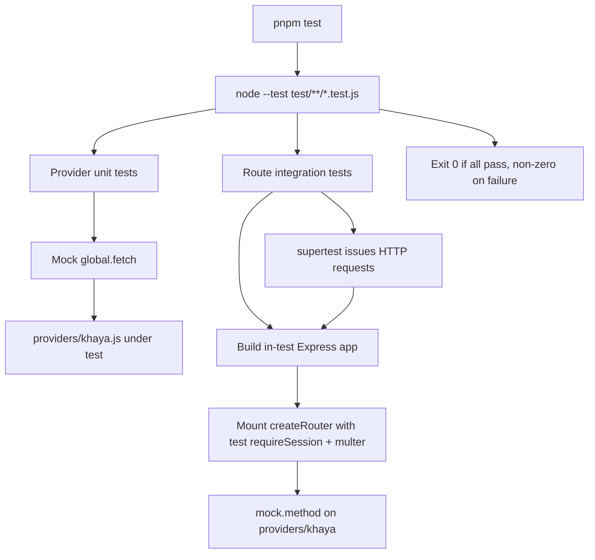

# Design Document

## Overview

This design describes an automated test suite for the Khaya AI (GhanaNLP) ASR integration in the Node.js/Express backend. The integration under test consists of two modules:

- `providers/khaya.js` — the provider that calls the Khaya AI ASR API (`transcribe`, `getLanguages`, `getApiKey`).
- `routes/khaya.js` — an Express router factory (`createRouter(requireSession, upload)`) mounted at `/api/khaya`, exposing `POST /transcription` and `GET /languages`.

The project has no test framework configured today. This design introduces a lightweight setup aligned with the project's conventions (Node.js CommonJS, vanilla JS, `corepack pnpm`, minimal pinned dependencies) and defines the structure and strategy for tests covering provider behavior, route behavior, JWT authentication, input validation, provider-error mapping, and response-shape normalization.

The suite is fully hermetic: it never contacts the live Khaya AI API and never reads the `test_audio` directory. All external behavior is simulated by mocking `global.fetch`, mocking the provider module (for route tests), and generating JWTs with the same secret the app uses. Audio inputs and API responses come from in-memory fixtures.

### Goals

- Provide a runnable `test` script that exits non-zero on failure and makes no network calls.
- Cover every testable acceptance criterion in the requirements with focused unit and integration tests.
- Keep the dependency footprint minimal, with exact pinned versions in `devDependencies`.

### Non-Goals

- Testing the Deepgram integration or other server routes.
- End-to-end tests against the real Khaya AI service.
- Reading or fixture-loading real audio files from `test_audio`.

## Research and Key Decisions

### Test runner: `node:test`

Node's built-in `node:test` module (stable since Node 20, and the project pins `node >= 24`) is the natural fit. It requires no additional runtime dependency, supports CommonJS directly, runs in a single non-watch pass via `node --test`, and exits with a non-zero status code when any test fails. This satisfies Requirement 1 (CommonJS-compatible, runnable via a `test` script, single non-watch run, correct exit codes) with zero added production or runtime dependencies. Assertions use the built-in `node:assert/strict` module.

Decision: use `node:test` + `node:assert/strict` as the runner and assertion library. No third-party runner (Jest, Mocha, Vitest) is introduced, keeping the dependency surface minimal per project conventions.

### HTTP-level route testing: `supertest`

Route tests need to issue real HTTP requests (including `multipart/form-data` file uploads and `Authorization` headers) against an Express app and assert on status codes and JSON bodies. `supertest` is the standard, minimal choice: it boots the app on an ephemeral port and provides a fluent request/assertion API, including `.attach()` for multipart uploads and `.field()` for form fields. This is the only new dependency required.

Decision: add `supertest` as the single new `devDependency`, pinned to an exact version.

### `fetch` mocking strategy

The provider calls the global `fetch` (available natively in Node 24). Rather than adding a mocking library, tests replace `global.fetch` with a stub function before each provider test and restore the original afterward. This is a well-supported, dependency-free pattern:

```js
const originalFetch = global.fetch;
afterEach(() => { global.fetch = originalFetch; });
```

The stub returns a minimal `Response`-like object exposing `ok`, `status`, `json()`, and `text()` — exactly the fields the provider reads. It also records the URL and options it was called with, so tests can assert on the request path, query parameters, and headers (Requirements 2.1, 2.2, 4.1, 4.2).

Decision: mock `global.fetch` directly with a recording stub; no HTTP-mocking dependency (nock, msw, etc.) is added.

### Provider mocking for route isolation (CommonJS)

Route tests for input validation, success passthrough, and error mapping (Requirements 5–8) should exercise the router without invoking the real provider. Because `routes/khaya.js` is a factory that `require`s `../providers/khaya` at module load, the cleanest CommonJS approach is to mutate the cached provider module's exports before building the router. Node's `require` cache returns the same object instance, so replacing its methods with test doubles makes the router call the doubles:

```js
const khaya = require("../providers/khaya");
const original = { transcribe: khaya.transcribe, getLanguages: khaya.getLanguages };
beforeEach(() => { /* assign stub fns to khaya.transcribe / khaya.getLanguages */ });
afterEach(() => { Object.assign(khaya, original); });
```

`node:test` also offers `mock.method(khaya, "transcribe", stub)`, which restores automatically and records call arguments — this is the preferred mechanism for asserting the provider was called with the expected buffer, mimetype, and language (Requirement 6.3).

Decision: use `node:test`'s `mock.method` on the cached provider module object to substitute `transcribe`/`getLanguages` in route tests, avoiding any module-loader interception library.

### Environment-dependent constants and the module cache

`providers/khaya.js` reads `KHAYA_ASR_VERSION` **once at module load** into a top-level `ASR_VERSION` constant, while `KHAYA_API_KEY` is read **on each call** via `getApiKey()`. This distinction drives the env-handling strategy:

- `KHAYA_API_KEY`: set/unset `process.env.KHAYA_API_KEY` directly in the test before calling the provider; no reload needed.
- `KHAYA_ASR_VERSION`: to test a non-default version (Requirement 2.8) the module must be re-required after setting the env var, because the constant is captured at load time. Tests that need a specific version will delete the provider from `require.cache` and re-require it inside an isolated block:

```js
delete require.cache[require.resolve("../providers/khaya")];
process.env.KHAYA_ASR_VERSION = "v3";
const khaya = require("../providers/khaya");
```

A shared helper (`loadProviderWithEnv`) encapsulates cache clearing, env setup, and restoration so individual tests stay readable. Each test restores the original env values and clears the cache afterward to avoid cross-test leakage.

Decision: document and centralize module-cache handling in a helper; treat `ASR_VERSION` as load-time-bound and `API_KEY` as call-time-bound.

### JWT generation for auth tests

`server.js` signs and verifies session tokens with `SESSION_SECRET` using `jsonwebtoken`. Route tests set `process.env.SESSION_SECRET` to a known value before building the app, then sign tokens with the same `jsonwebtoken` library and secret:

- Valid token: `jwt.sign({ iat: ... }, SESSION_SECRET, { expiresIn: "1h" })`.
- Expired/invalid token: sign with `{ expiresIn: -1 }` (expired) or use a malformed/differently-signed string (invalid) to trigger `INVALID_TOKEN`.
- Missing token: omit the `Authorization` header entirely to trigger `MISSING_TOKEN`.

Because `requireSession` lives in `server.js` (which starts a listener on import), route tests do **not** import `server.js`. Instead they construct a small Express app in-test that reuses the same `requireSession` logic and mounts the Khaya router. See Architecture for how `requireSession` is provided to the router.

## Architecture

### Test execution flow



### Two layers of testing

1. **Provider unit tests** (`test/providers/khaya.test.js`): import the provider (directly, or via the env helper), stub `global.fetch`, and assert on request construction, response normalization, and error translation. No Express, no HTTP.

2. **Route integration tests** (`test/routes/khaya.test.js`): build a minimal Express app that wires the real `createRouter` factory to a test `requireSession` middleware and a real in-memory `multer` instance, substitute the provider methods with `mock.method`, and drive it with `supertest`. This exercises auth, validation, success passthrough, and error mapping through the actual HTTP stack.

### In-test Express app builder

A helper (`buildApp`) constructs the app so tests do not import `server.js` (which binds a port and loads the Deepgram client):

```mermaid
flowchart LR
    subgraph buildApp
        A[express()] --> B[app.use cors optional]
        B --> C[requireSession test copy]
        C --> D[multer memoryStorage upload]
        D --> E[createRouter requireSession, upload]
        E --> F[app.use /api/khaya router]
    end
```

`buildApp` uses a `requireSession` implementation identical in behavior to `server.js` (same `MISSING_TOKEN`/`INVALID_TOKEN` structured errors, same `SESSION_SECRET`). This keeps auth tests faithful to production behavior while keeping the app importable without side effects. The helper is the single source of truth for the auth middleware used in tests, and its behavior is asserted directly by the authentication tests (Requirement 5), so any drift from `server.js` semantics is caught.

## Components and Interfaces

### Directory structure

```text
test/
  helpers/
    fetchMock.js        # createFetchMock(): recording stub for global.fetch
    providerEnv.js      # loadProviderWithEnv({ apiKey, asrVersion }); restore()
    jwt.js              # signValidToken(), signExpiredToken(), invalidToken()
    app.js              # buildApp(): in-test Express app + requireSession
  fixtures/
    audio.js            # in-memory Buffers (fake mp3/wav bytes) + mimetypes
    responses.js        # sample Khaya success/error API payloads, languages payload
  providers/
    khaya.test.js       # provider unit tests (Requirements 2, 3, 4)
  routes/
    khaya.test.js       # route integration tests (Requirements 5, 6, 7, 8)
```

### Helper: `fetchMock.js`

```js
/**
 * Creates a stub for global.fetch that returns a predetermined response
 * and records every call for later assertion.
 * @param {{ ok?: boolean, status?: number, jsonBody?: any, textBody?: string }} opts
 * @returns {{ fn: Function, calls: Array<{ url: string, options: object }> }}
 */
function createFetchMock(opts) { /* ... */ }
```

- `fn` is assigned to `global.fetch`.
- Each invocation pushes `{ url, options }` to `calls`.
- The returned response object implements `ok`, `status`, `async json()` (returns `jsonBody`), and `async text()` (returns `textBody`).
- Supports returning a raw JSON string body (for Requirement 2.3) versus an object body (2.4–2.6) via `jsonBody`.

### Helper: `providerEnv.js`

```js
/**
 * Clears the provider from require cache, sets env vars, and returns a fresh
 * provider module bound to those vars. Returns a restore() to undo changes.
 * @param {{ apiKey?: string|undefined, asrVersion?: string|undefined }} env
 * @returns {{ khaya: object, restore: Function }}
 */
function loadProviderWithEnv(env) { /* ... */ }
```

Handles the load-time `ASR_VERSION` binding and call-time `API_KEY` reads described in Research. `restore()` resets `process.env` keys to their prior values and clears the cache.

### Helper: `jwt.js`

```js
function signValidToken(secret) { /* jwt.sign, expiresIn 1h */ }
function signExpiredToken(secret) { /* jwt.sign, expiresIn -1 */ }
function invalidToken() { /* return a malformed token string */ }
```

### Helper: `app.js`

```js
/**
 * Builds an Express app that mounts the real Khaya router with a
 * production-faithful requireSession and an in-memory multer instance.
 * @param {{ secret: string }} opts
 * @returns {import('express').Express}
 */
function buildApp(opts) { /* ... */ }
```

### Fixtures: `audio.js`

Exports small in-memory `Buffer`s representing fake audio bytes plus their mimetypes (for example `{ buffer: Buffer.from([...]), mimetype: "audio/mpeg" }`). No filesystem access; nothing is read from `test_audio`.

### Fixtures: `responses.js`

Exports representative Khaya payloads:
- A JSON string transcript body.
- An object body with `transcript`, `words`, `duration`.
- An object body with `text` but no `transcript`.
- A languages list payload.
- Error bodies/status codes for 401, 429, and generic 5xx.

### Component-to-file mapping

| Component | File | Consumes |
|-----------|------|----------|
| Provider unit tests | `test/providers/khaya.test.js` | `fetchMock`, `providerEnv`, `responses`, `audio` |
| Route integration tests | `test/routes/khaya.test.js` | `app`, `jwt`, `audio`, provider `mock.method` |
| fetch stub | `test/helpers/fetchMock.js` | — |
| env/module-cache helper | `test/helpers/providerEnv.js` | `providers/khaya.js` |
| JWT helpers | `test/helpers/jwt.js` | `jsonwebtoken` |
| App builder | `test/helpers/app.js` | `express`, `multer`, `createRouter`, `jsonwebtoken` |

## Data Models

### Recorded fetch call

```text
{
  url: string,          // full request URL including query string
  options: {
    method?: string,
    headers?: Record<string, string>,
    body?: Buffer
  }
}
```

Used to assert URL path (`/asr/{version}/transcribe`, `/asr/{version}/languages`), the URL-encoded `language` query parameter, the `Ocp-Apim-Subscription-Key` header, and the `Content-Type: audio/mpeg` header.

### Transcription_Result (provider output under test)

```text
{
  transcript: string,
  words: Array,
  duration: number | undefined,
  metadata: {
    provider: "khaya-ai",
    api_version: string,   // configured KHAYA_ASR_VERSION
    language: string       // requested language
  }
}
```

### Structured_Error (route output under test)

```text
{
  error: {
    type: string,   // e.g. ValidationError, AuthenticationError, RateLimitError
    code: string,   // e.g. MISSING_INPUT, INVALID_TOKEN, QUOTA_EXCEEDED
    message: string
  }
}
```

### Test fixture: audio input

```text
{
  buffer: Buffer,       // fake in-memory bytes
  mimetype: string      // e.g. "audio/mpeg"
}
```

## Error Handling

The suite verifies error behavior of the code under test rather than introducing its own runtime error handling. Key concerns:

- **Provider error translation**: each error branch (`MISSING_API_KEY` 500/ConfigurationError, `INVALID_API_KEY` 401/AuthenticationError, `QUOTA_EXCEEDED` 429/RateLimitError, `TRANSCRIPTION_FAILED` other/TranscriptionError, `LANGUAGES_FETCH_FAILED`/ProviderError) is asserted by driving `global.fetch` to the corresponding status and inspecting the thrown error's `statusCode`, `code`, and `type`. Tests use `assert.rejects` with a predicate that checks those fields.
- **Route error mapping**: provider methods are mocked to throw errors with and without `statusCode`, and the HTTP response status and structured-error body are asserted (Requirement 8), including the fallback to 500 with `TRANSCRIPTION_FAILED`/`LANGUAGES_FETCH_FAILED` when `statusCode` is absent.
- **Test isolation failures**: helpers always restore `global.fetch`, `process.env`, the `require` cache, and mocked provider methods in `afterEach`/`restore()` to prevent one failing test from cascading. `node:test`'s `mock.restoreAll()` is called after route tests.
- **Hermeticity guard**: fixtures are in-memory only; no helper touches the filesystem or the real network, satisfying Requirements 1.6 and 1.7 by construction. If `global.fetch` is ever invoked without a stub in place, the default (unstubbed) case is avoided because every provider test installs the stub in `beforeEach`.

## Testing Strategy

### Applicability of property-based testing

Property-based testing is **not** applied in this feature. The feature is itself a test suite, and its acceptance criteria describe specific, example-based verifications of existing code: exact error-to-status mappings, presence of specific headers and query parameters, specific response-shape normalization branches, and auth enforcement for specific token states. These are concrete scenarios and edge cases rather than universally quantified properties over a large input space, and the modules under test are thin adapters around an external HTTP API (mocked here) rather than pure algorithmic functions. Per the workflow guidance (adapters/CRUD/side-effecting HTTP layers, example-driven criteria), the Correctness Properties section is intentionally omitted, and coverage is achieved through unit tests (provider) and integration tests (routes).

### Test framework and dependencies

- Runner/assertions: `node:test` and `node:assert/strict` (built-in, no dependency).
- HTTP integration: `supertest` (new `devDependency`, exact pinned version).
- `package.json` `scripts.test`: `node --test` (single non-watch run; non-zero exit on failure).
- All new dependencies pinned exactly in `devDependencies` (Requirement 1.5).

### Provider unit tests (`test/providers/khaya.test.js`)

Covers Requirements 2, 3, 4. For each test, install a `createFetchMock` stub, set `KHAYA_API_KEY` (and, where needed, reload the module for a specific `KHAYA_ASR_VERSION`), call the provider, then assert.

- Success request construction: URL path `/asr/{version}/transcribe`, URL-encoded `language` query param, `Ocp-Apim-Subscription-Key` header equals `KHAYA_API_KEY`, `Content-Type: audio/mpeg` (2.1, 2.2).
- Response normalization branches: string body → `transcript`; object with `transcript`; object with `text` only; `words`/`duration` passthrough; metadata `provider`/`api_version`/`language` (2.3–2.7).
- Non-default `KHAYA_ASR_VERSION` reflected in URL path via reloaded module (2.8).
- Error branches for `transcribe`: missing key (500/MISSING_API_KEY/ConfigurationError), 401, 429, generic 5xx (3.1–3.4).
- `getLanguages`: missing-key error (3.5), non-ok response error (3.6), success path targets `/asr/{version}/languages` with the subscription-key header and returns the body verbatim (4.1–4.3).

### Route integration tests (`test/routes/khaya.test.js`)

Covers Requirements 5, 6, 7, 8. Build the app with `buildApp({ secret })`, mock provider methods with `mock.method`, and drive with `supertest`.

- Auth: missing header → 401 `MISSING_TOKEN`; invalid/expired token → 401 `INVALID_TOKEN`; valid token reaches validation/provider; `GET /languages` requires no auth (5.1–5.4).
- Validation: missing file → 400 `ValidationError`/`MISSING_INPUT`; file present but missing language → 400 `ValidationError`/`MISSING_LANGUAGE`; both present → provider `transcribe` called with buffer, mimetype, language (6.1–6.3).
- Success passthrough: `transcribe` result returned with 200 and identical body; `getLanguages` payload returned with 200 (7.1, 7.2).
- Error mapping: provider throws with `statusCode` 401/429/500 → same status + structured error; throw without `statusCode` → 500 `TRANSCRIPTION_FAILED`/`TranscriptionError`; `getLanguages` throw with/without `statusCode` mapped accordingly (8.1–8.6).

### Unit vs integration balance

- Provider tests are unit-level (no Express), isolating request building and normalization logic behind a `fetch` stub.
- Route tests are integration-level (real Express + multer + supertest), isolating provider behavior behind `mock.method`.
- Together they cover the wire between HTTP layer and provider without touching the network or the Deepgram code path.

### Execution and CI

- Local: `pnpm test` → `node --test`.
- Exit codes: zero on all-pass, non-zero on any failure (Requirement 1.3, 1.4).
- No network access and no `test_audio` reads at any point (Requirement 1.6, 1.7).

## Requirements Traceability

| Requirement | Acceptance Criteria | Design element |
|-------------|--------------------|----------------|
| 1 Test tooling & execution | 1.1–1.7 | `node:test` runner, `package.json` `test` script, pinned `supertest` devDependency, in-memory fixtures, no-network/no-`test_audio` design |
| 2 Provider transcription success | 2.1–2.8 | `test/providers/khaya.test.js` + `fetchMock` (request assertions) + `providerEnv` (version reload) + `responses` fixtures |
| 3 Provider error handling | 3.1–3.6 | Provider tests driving `fetchMock` to 401/429/5xx and unset key; `assert.rejects` field checks |
| 4 Provider languages retrieval | 4.1–4.3 | Provider `getLanguages` tests + `fetchMock` URL/header/body assertions |
| 5 Route authentication | 5.1–5.4 | `test/routes/khaya.test.js` + `jwt` helpers + `buildApp` `requireSession` |
| 6 Route input validation | 6.1–6.3 | Route tests + `supertest` multipart uploads + provider `mock.method` call-arg assertions |
| 7 Route success response | 7.1–7.2 | Route tests + provider `mock.method` returning fixtures; body-equality assertions |
| 8 Route error mapping | 8.1–8.6 | Route tests + provider `mock.method` throwing errors with/without `statusCode` |
```
