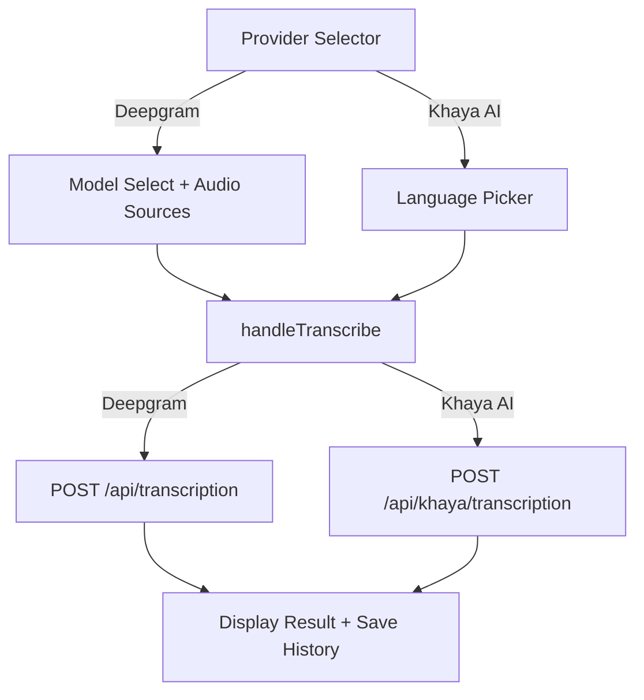

# Design Document: Khaya Frontend Integration

## Overview

This design adds a provider selection layer to the existing transcription frontend, enabling users to choose between Deepgram and Khaya AI. When Khaya AI is selected, a dynamic language picker replaces the model selector, and `handleTranscribe()` routes to the appropriate backend endpoint. History entries are extended with a `provider` field for display differentiation.

The implementation stays within the existing vanilla JS architecture — no new files, no build changes, no frameworks. All changes happen in `frontend/index.html` (HTML + CSS) and `frontend/main.js` (logic).

## Architecture



Data flow:
1. User selects provider via radio buttons in the sidebar
2. UI toggles between Deepgram controls (model select, URL cards) and Khaya controls (language picker)
3. `handleTranscribe()` reads the active provider and builds the correct FormData + endpoint
4. Response is normalized and saved to localStorage history with the provider identified

## Components and Interfaces

### 1. Provider Selector (HTML + JS)

A pair of radio buttons inside a new `controls-section` div, placed as the first controls section in the left sidebar (before audio source selection).

```html
<div class="controls-section" id="providerSection">
  <div class="dg-form-field dg-form-field--full">
    <label class="dg-form-label">Provider</label>
    <div class="provider-selector">
      <label class="dg-card dg-card--selectable">
        <input type="radio" name="provider" value="deepgram" checked>
        <div class="dg-card--selectable__content">
          <div class="dg-item-title">
            <i class="fa-solid fa-waveform-lines dg-card--selectable__icon"></i>
            Deepgram
          </div>
        </div>
      </label>
      <label class="dg-card dg-card--selectable">
        <input type="radio" name="provider" value="khaya">
        <div class="dg-card--selectable__content">
          <div class="dg-item-title">
            <i class="fa-solid fa-language dg-card--selectable__icon"></i>
            Khaya AI
          </div>
        </div>
      </label>
    </div>
  </div>
</div>
```

Styling: Uses the existing `dg-card--selectable` pattern but in a 2-column grid (same as audio source cards). The `.provider-selector` div gets `display: grid; grid-template-columns: repeat(2, 1fr); gap: 1rem;`.

### 2. Language Picker (HTML + JS)

A `<select>` dropdown using `dg-input` class, placed inside its own `controls-section` div. Hidden by default, shown only when Khaya AI is selected.

```html
<div class="controls-section" id="languageSection" style="display: none;">
  <div class="dg-form-field dg-form-field--full">
    <label for="khayaLanguage" class="dg-form-label">Language</label>
    <select id="khayaLanguage" class="dg-input" disabled>
      <option value="">Loading languages...</option>
    </select>
  </div>
</div>
```

### 3. Provider Switch Handler (JS)

New function `handleProviderChange()` in main.js:

```javascript
function handleProviderChange() {
  const provider = getSelectedProvider();
  const modelSection = document.getElementById("modelSection");       // existing, needs id
  const languageSection = document.getElementById("languageSection");
  const audioSourceCards = document.querySelectorAll("#card-spacewalk, #card-bueller, #card-conversation");

  if (provider === "khaya") {
    // Show language picker, hide model select
    languageSection.style.display = "block";
    modelSection.style.display = "none";
    // Disable URL-based audio cards (Khaya only accepts file uploads)
    audioSourceCards.forEach(card => {
      card.classList.add("dg-card--disabled");
      card.querySelector("input[type=radio]").disabled = true;
      card.querySelector("input[type=radio]").checked = false;
    });
    // Fetch languages if not already loaded
    fetchKhayaLanguages();
  } else {
    // Show model select, hide language picker
    languageSection.style.display = "none";
    modelSection.style.display = "block";
    // Re-enable URL audio cards
    audioSourceCards.forEach(card => {
      card.classList.remove("dg-card--disabled");
      card.querySelector("input[type=radio]").disabled = false;
    });
  }
  updateFormValidation();
}
```

### 4. Language Fetcher (JS)

```javascript
const KHAYA_LANGUAGES_ENDPOINT = "api/khaya/languages";
let khayaLanguagesLoaded = false;

async function fetchKhayaLanguages() {
  if (khayaLanguagesLoaded) return;
  const select = document.getElementById("khayaLanguage");
  select.disabled = true;
  select.innerHTML = '<option value="">Loading languages...</option>';

  try {
    const response = await fetch(KHAYA_LANGUAGES_ENDPOINT);
    if (!response.ok) throw new Error(`Failed: ${response.status}`);
    const data = await response.json();
    const languages = data.languages || data;

    select.innerHTML = languages.map(lang =>
      `<option value="${lang.code}">${escapeHtml(lang.name)}</option>`
    ).join("");
    select.disabled = false;
    khayaLanguagesLoaded = true;
  } catch (err) {
    select.innerHTML = '<option value="">Failed to load languages</option>';
    showError("Could not load Khaya AI languages. Check your connection.");
  }
  updateFormValidation();
}
```

Note: This endpoint does not require auth (`GET /api/khaya/languages` has no `requireSession` middleware), so we use plain `fetch()`.

### 5. Modified handleTranscribe() (JS)

The existing function is extended with a provider check at the top:

```javascript
async function handleTranscribe() {
  const provider = getSelectedProvider();

  if (provider === "khaya") {
    await handleKhayaTranscribe();
    return;
  }
  // ... existing Deepgram logic unchanged ...
}

async function handleKhayaTranscribe() {
  const file = audioFileInput.files[0];
  const language = document.getElementById("khayaLanguage").value;

  if (!file) {
    showError("Please upload an audio file for Khaya AI transcription");
    return;
  }
  if (!language) {
    showError("Please select a language");
    return;
  }

  disableFormElements();
  showWorking();

  try {
    const formData = new FormData();
    formData.append("file", file);
    formData.append("language", language);

    const response = await authenticatedFetch("api/khaya/transcription", {
      method: "POST",
      body: formData,
    });

    if (!response.ok) {
      const errorData = await response.json().catch(() => ({}));
      if (errorData.error?.message) {
        throw new Error(errorData.error.message);
      }
      throw new Error(`Request failed with status ${response.status}`);
    }

    const data = await response.json();
    const historyEntry = saveTranscriptionToHistory(data, file.name, "khaya-ai", "khaya-ai");
    activeRequestId = historyEntry?.id || null;

    enableFormElements();
    displayTranscript(data);
    displayMetadata(data);
    hideStatus();
    renderHistory();
  } catch (error) {
    enableFormElements();
    showError(error.message);
  }
}
```

### 6. Modified Form Validation (JS)

```javascript
function isFormValid() {
  const provider = getSelectedProvider();

  if (provider === "khaya") {
    const hasFile = audioFileInput?.files?.length > 0;
    const hasLanguage = !!document.getElementById("khayaLanguage")?.value;
    return hasFile && hasLanguage;
  }

  // Deepgram: existing logic
  const selectedRadio = document.querySelector('input[name="audioSource"]:checked');
  const hasFile = audioFileInput?.files?.length > 0;
  return !!(selectedRadio || hasFile);
}
```

### 7. Modified History (JS)

`saveTranscriptionToHistory()` gains an optional `provider` parameter:

```javascript
function saveTranscriptionToHistory(transcriptionData, audioSource, model, provider = "deepgram") {
  // ... existing logic ...
  const historyEntry = {
    id: requestId,
    timestamp: new Date().toISOString(),
    audioSource,
    model,
    provider,  // NEW: "deepgram" or "khaya-ai"
    response: transcriptionData,
  };
  // ...
}
```

History item rendering adds the provider badge:

```javascript
item.innerHTML = `
  <div class="history-item__id" title="${entry.id}">${entry.id}</div>
  <div class="history-item__time">${timeStr}</div>
  <div class="history-item__model">${entry.provider === "khaya-ai" ? "Khaya AI" : entry.model || "nova-3"}</div>
`;
```

### 8. Utility: getSelectedProvider()

```javascript
function getSelectedProvider() {
  const radio = document.querySelector('input[name="provider"]:checked');
  return radio ? radio.value : "deepgram";
}
```

## Data Models

### Language Response (from GET /api/khaya/languages)

```json
{
  "languages": [
    { "code": "tw", "name": "Asante Twi" },
    { "code": "ee", "name": "Ewe" },
    { "code": "gaa", "name": "Ga" },
    { "code": "dag", "name": "Dagbani" }
  ]
}
```

### History Entry (localStorage)

```json
{
  "id": "local_1700000000000",
  "timestamp": "2024-01-15T10:30:00.000Z",
  "audioSource": "recording.mp3",
  "model": "khaya-ai",
  "provider": "khaya-ai",
  "response": {
    "transcript": "...",
    "words": [],
    "duration": 12.5,
    "metadata": {
      "provider": "khaya-ai",
      "api_version": "v3",
      "language": "tw"
    }
  }
}
```

### Khaya Transcription Request (multipart/form-data)

| Field | Type | Required |
|-------|------|----------|
| file | File (audio/*) | Yes |
| language | string (e.g. "tw") | Yes |

### Khaya Transcription Response

```json
{
  "transcript": "...",
  "words": [],
  "duration": 12.5,
  "metadata": {
    "provider": "khaya-ai",
    "api_version": "v3",
    "language": "tw"
  }
}
```

## Error Handling

| Scenario | Handling |
|----------|----------|
| Languages endpoint fails | Show error via `showError()`, disable language select, display "Failed to load languages" option |
| Khaya transcription 401 | `authenticatedFetch` clears token, shows "Session expired" |
| Khaya transcription 400 (missing file/language) | Display backend error message via `showError()` |
| Khaya transcription 429 (quota) | Display quota exceeded message |
| Khaya transcription 500 | Generic error message |
| Network failure during language fetch | Show error, keep language picker disabled |
| No file selected when Khaya is active | Button stays disabled via `isFormValid()` |

All errors use the existing `showError()` + `enableFormElements()` pattern. No new error handling infrastructure needed.

## Testing Strategy

Property-based testing is **not applicable** for this feature. This is a UI integration feature involving DOM manipulation, event handling, and API calls to external services. There are no pure functions with meaningful input variation that would benefit from PBT.

### Recommended Testing Approach

**Manual Testing (Primary):**
- Toggle provider selector and verify UI state changes
- Verify language picker loads and displays correctly
- Submit Khaya transcription with file + language
- Verify history entries show provider name
- Verify form validation per provider
- Test error states (no file, no language, network failure)

**Example-Based Unit Tests (Optional):**
- `getSelectedProvider()` returns correct value based on DOM state
- `isFormValid()` returns correct result for each provider scenario
- History entries include `provider` field after save

**Integration Tests:**
- `GET /api/khaya/languages` returns expected shape
- `POST /api/khaya/transcription` with file + language returns transcript

**State Preview Mode:**
- Add `?state=khaya` URL param for testing Khaya AI UI state during development

### Why Not PBT

- The feature is DOM manipulation and API wiring — no algorithmic logic
- Input doesn't meaningfully vary in ways that reveal edge cases through randomization
- The "functions" are event handlers with side effects (DOM updates, fetch calls)
- Standard example-based tests and manual verification are more appropriate
